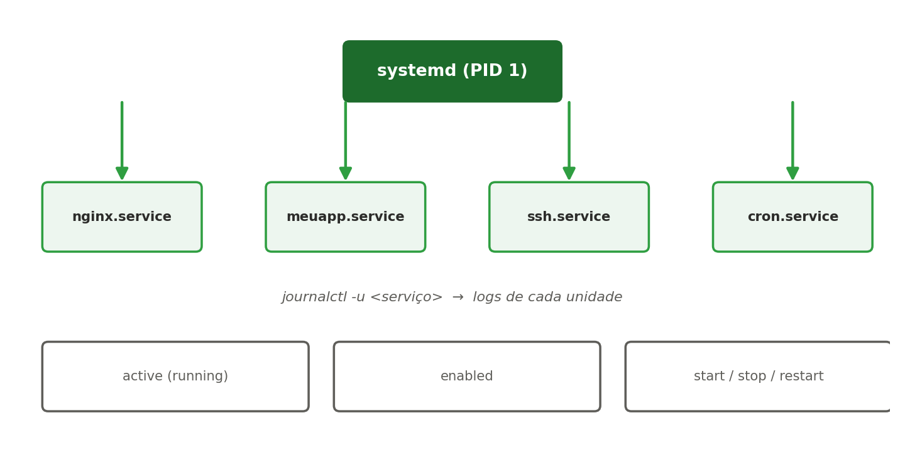
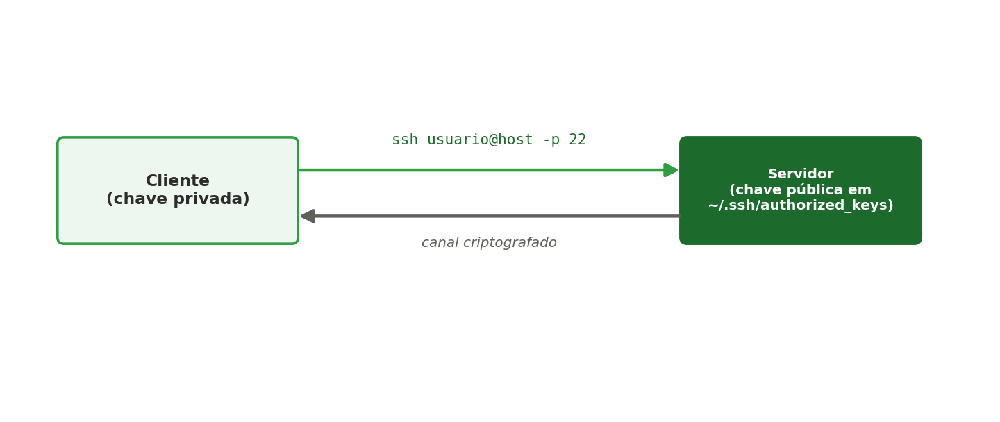
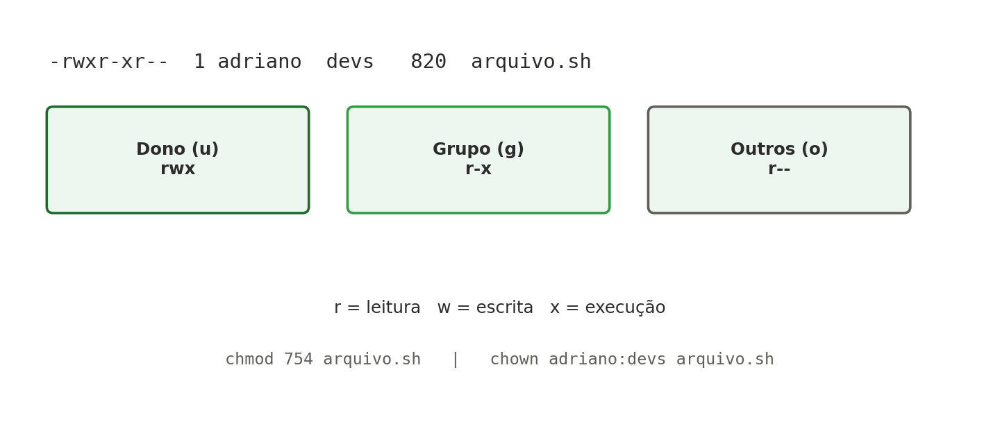
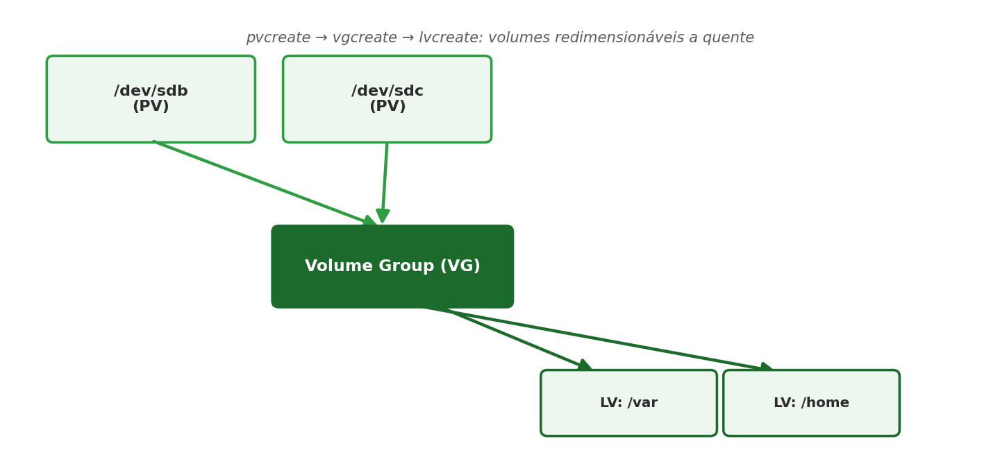
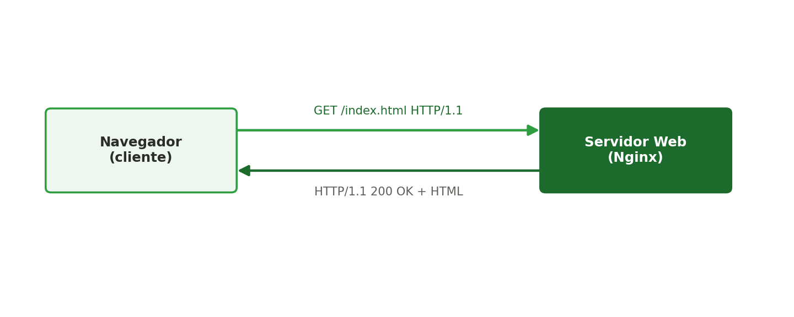
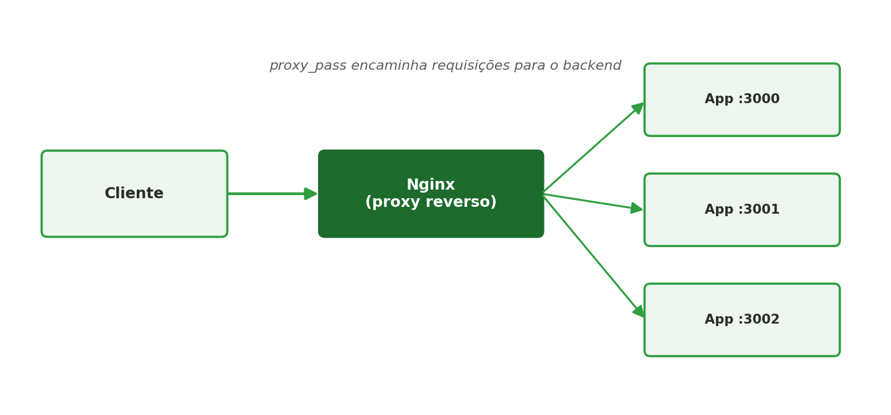
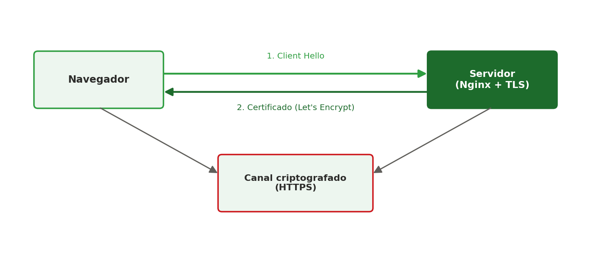

# Administração Avançada de Sistemas Operacionais
### Semanas 2 a 8 — Fundamentos (Linux + Servidor Web)

> Material de apoio da disciplina, com teoria, comandos, imagens e exercícios.
> **Ambiente considerado: WSL2 (Windows Subsystem for Linux) com Ubuntu.**

---

## Antes de começar: preparando o WSL2

Todos os comandos deste material foram pensados para rodar dentro do **WSL2**. Alguns pontos importantes:

1. **Instalação** (PowerShell como administrador):
   ```powershell
   wsl --install -d Ubuntu
   ```
2. **Systemd no WSL2**: por padrão pode vir desabilitado. Para habilitar, edite `/etc/wsl.conf` dentro da distribuição:
   ```ini
   [boot]
   systemd=true
   ```
   Depois, no PowerShell:
   ```powershell
   wsl --shutdown
   ```
   E abra o Ubuntu novamente. Sem isso, os comandos `systemctl` da Semana 2 não funcionam.
3. **Rede**: o WSL2 expõe `localhost` automaticamente para o Windows — ao subir um servidor web na porta 80, ele já pode ser acessado em `http://localhost` no navegador do Windows.
4. **Limitações importantes**: o WSL2 roda sobre um disco virtual único (`.vhdx`), então **não há discos físicos separados** para praticar LVM "de verdade". Na Semana 4, vamos usar **arquivos de disco virtuais (loop devices)** para simular volumes — o comportamento dos comandos é idêntico ao de um servidor real.

---

## Semana 2 — Gerenciamento de processos e serviços

### Teoria — processos

Todo programa em execução no Linux é um **processo**, identificado por um **PID** (Process ID). Todo processo, exceto o primeiro, tem um processo pai — identificado pelo **PPID** — formando uma hierarquia.

**Visualizar processos:**

```bash
# Lista todos os processos do sistema (formato BSD)
ps aux

# Lista todos os processos do sistema (formato padrão UNIX)
ps -ef

# Visão dinâmica, em tempo real, de CPU e memória
top

# Versão mais amigável do top (pode exigir instalação: sudo apt install htop)
htop
```

**PID, PPID e hierarquia de processos:**

```bash
# Mostra a árvore de processos (pai/filho)
pstree

# Mostra a árvore com PIDs
pstree -p
```

**Estados de um processo:** ao rodar `ps aux`, a coluna `STAT` mostra o estado atual:
- `R` — rodando (running)
- `S` — dormindo, aguardando algum evento (sleeping)
- `Z` — zumbi, processo finalizado mas ainda não "limpo" pelo pai (zombie)
- `T` — parado (stopped)

**Sinais e finalização:**

```bash
# Encerramento "educado" — pede para o processo finalizar (SIGTERM)
kill -15 <PID>

# Encerramento forçado — mata o processo imediatamente (SIGKILL)
kill -9 <PID>

# Mata todos os processos com um determinado nome
killall firefox

# Mata processos por padrão de nome/linha de comando
pkill -f http.server
```

> Prefira sempre tentar `kill -15` antes de `kill -9`: o `SIGTERM` permite que o processo finalize tarefas pendentes (salvar arquivos, fechar conexões) antes de encerrar. O `SIGKILL` interrompe na hora, sem chance de limpeza.

**Processos em foreground/background:**

```bash
# Roda um processo em segundo plano (background)
sleep 100 &

# Suspende o processo que está rodando em primeiro plano (foreground)
# Ctrl+Z
```

Quando você aperta `Ctrl+Z`, o processo em foreground é pausado (estado `T`) e devolve o terminal para você — ele continua existindo, mas parado, até ser retomado ou finalizado.

### Teoria — systemd

O **systemd** é o sistema de inicialização (`init`) usado pela maioria das distribuições Linux modernas, incluindo o Ubuntu. Ele é o primeiro processo a rodar (PID 1) e é responsável por iniciar, parar e supervisionar todos os demais serviços (chamados de *units*).



Principais conceitos:
- **Unit**: uma unidade gerenciável pelo systemd (serviço, timer, socket, etc.). Serviços usam a extensão `.service`.
- **Estado de execução**: `active (running)`, `inactive (dead)`, `failed`.
- **Habilitado (enabled)**: o serviço inicia automaticamente no boot, independentemente de estar rodando agora.

### Comandos essenciais — systemd

```bash
# Ver status de um serviço
sudo systemctl status ssh

# Iniciar, parar e reiniciar
sudo systemctl start ssh
sudo systemctl stop ssh
sudo systemctl restart ssh

# Habilitar/desabilitar no boot
sudo systemctl enable ssh
sudo systemctl disable ssh

# Listar todos os serviços ativos
systemctl list-units --type=service --state=running

# Ver logs de um serviço específico
journalctl -u ssh -f
```

### Criando um serviço próprio

Crie o arquivo `/etc/systemd/system/meuapp.service`:

```ini
[Unit]
Description=Minha aplicação de teste
After=network.target

[Service]
ExecStart=/usr/bin/python3 -m http.server 8000
Restart=on-failure
User=www-data

[Install]
WantedBy=multi-user.target
```

Depois:

```bash
sudo systemctl daemon-reload
sudo systemctl enable --now meuapp.service
sudo systemctl status meuapp.service
```

Teste se o serviço está realmente rodando:

```bash
ps -aux | grep http.server
```

Você deve ver um processo do Python rodando com o usuário `www-data`. Em seguida, abra o navegador (no Windows, se estiver no WSL2) e acesse:

```
http://localhost:8000
```

Se tudo estiver certo, o navegador vai mostrar a listagem de arquivos do diretório onde o serviço foi iniciado.

### Exercícios

1. Instale o pacote `apache2` (`sudo apt install apache2`) e pratique start/stop/restart/status.
2. Crie um serviço systemd customizado que rode um script shell simples (`/bin/sh -c 'echo "rodando em $(date +%Y-%m-%d_%H:%M:%S)" >> /tmp/log.txt'`) a cada execução.
3. Use `journalctl -u <serviço> --since "10 min ago"` para investigar os logs recentes de um serviço.
4. Desafio: faça um serviço falhar de propósito (ex.: aponte para um binário inexistente) e use `journalctl` para diagnosticar o erro.

---

## Complemento — Acesso SSH, rede básica e teste de conectividade

> Conteúdo de apoio às Semanas 2-3, usado sempre que for necessário acessar ou testar um servidor remotamente.

### Teoria

O **SSH (Secure Shell)** é o protocolo padrão para acesso remoto e seguro a servidores Linux — substitui protocolos antigos e não criptografados como Telnet. A autenticação pode ser feita por senha ou, de forma mais segura, por **par de chaves** (privada no cliente, pública no servidor).



#### Par de chaves: pública e privada

A autenticação por chave usa **criptografia assimétrica**: em vez de uma única senha, são geradas duas chaves matematicamente relacionadas, mas com papéis diferentes:

- **Chave privada**: fica guardada apenas no computador do usuário (ex.: `~/.ssh/id_ed25519`). Nunca deve ser compartilhada, copiada para outra máquina ou enviada por e-mail/chat. É ela que "prova" a identidade do usuário.
- **Chave pública**: pode ser distribuída livremente (ex.: `~/.ssh/id_ed25519.pub`). É copiada para dentro do servidor, no arquivo `~/.ssh/authorized_keys` do usuário remoto.

O funcionamento, de forma simplificada:

1. O cliente pede para se conectar ao servidor.
2. O servidor verifica se existe, no `authorized_keys`, uma chave pública correspondente àquele cliente.
3. O servidor envia um desafio criptografado com a chave pública.
4. Só quem possui a **chave privada** correspondente consegue responder corretamente a esse desafio — sem nunca precisar transmitir a chave privada pela rede.

Por isso esse modelo é mais seguro que senha: mesmo que alguém intercepte toda a comunicação, não há uma senha trafegando que possa ser roubada, e a chave privada nunca sai da máquina do usuário.

> Boas práticas: proteja a chave privada com uma **passphrase** (senha adicional pedida ao usá-la), nunca a compartilhe, e use uma chave diferente por dispositivo/contexto quando possível.

Antes de acessar um servidor, também é importante saber **configurar e diagnosticar a rede**: qual IP a máquina possui, se ela enxerga a internet, se uma porta específica está acessível, etc.

### Comandos essenciais — SSH

No WSL2, o cliente e o servidor SSH normalmente estão na mesma distribuição Linux — por isso, em vez de um IP remoto, usamos `localhost`:

```bash
# 1. Instalar e habilitar o servidor SSH
sudo apt install openssh-server
sudo systemctl enable --now ssh
sudo systemctl status ssh

# 2. Gerar um par de chaves no cliente
ssh-keygen -t ed25519 -C "adriano@ifpe" -N ""
# O -N "" já define a passphrase como vazia, para um acesso totalmente sem senha
# (aceite o caminho padrão apertando Enter na pergunta do local do arquivo)

# 3. Copiar a chave pública para o servidor (autenticação sem senha)
ssh-copy-id seu_usuario@localhost
# Vai pedir a senha do usuário Linux uma última vez

# 4. Conectar — não deve mais pedir nem senha, nem passphrase
ssh seu_usuario@localhost
ssh seu_usuario@localhost -p 2222   # se a porta padrão foi alterada

# 5. Copiar arquivos via SSH (scp)
touch arquivo.txt
scp arquivo.txt adriano@127.0.0.1:~/
```

> **Já criou a chave com passphrase por engano e ela está sendo pedida a cada acesso?** Apague e gere de novo sem passphrase:
> ```bash
> rm ~/.ssh/id_ed25519 ~/.ssh/id_ed25519.pub
> ssh-keygen -t ed25519 -C "adriano@ifpe" -N ""
> ssh-copy-id seu_usuario@localhost
> ```
> Uma passphrase vazia é aceitável em ambiente de estudo/laboratório, mas não é recomendada em servidores de produção — lá, o ideal é manter a passphrase e usar um `ssh-agent` para não digitá-la a cada conexão.

> Se o objetivo for acessar um servidor de verdade em outra máquina da rede, basta trocar `localhost` pelo IP real do servidor (`usuario@192.168.x.x`) — o restante do processo é idêntico. Nesse caso, para acessar o WSL2 a partir de fora, também é preciso configurar port forwarding no Windows (`netsh interface portproxy`), já que o WSL2 usa uma rede NAT interna.

#### Alterando a porta padrão do SSH

Por padrão, o SSH escuta na porta **22** — como é bem conhecida, é também a porta mais visada em tentativas automatizadas de invasão. Uma prática comum de hardening é alterá-la para uma porta não padrão, como **7531**.

```bash
# Edite o arquivo de configuração do servidor SSH
sudo nano /etc/ssh/sshd_config
```

Localize a linha `#Port 22`, descomente e altere:

```
Port 7531
```

Salve o arquivo e reinicie o serviço para aplicar:

```bash
sudo systemctl restart ssh
```

A partir de agora, conecte sempre informando a porta com `-p`:

```bash
ssh seu_usuario@localhost -p 7531
ssh-copy-id -p 7531 seu_usuario@localhost
scp -P 7531 arquivo.txt seu_usuario@localhost:/home/seu_usuario/
```

> Repare que o parâmetro de porta é `-p` minúsculo no `ssh` e no `ssh-copy-id`, mas `-P` maiúsculo no `scp` — uma pegadinha comum.

Confirme que o serviço está de fato escutando na nova porta:

```bash
ss -tulpn | grep ssh
```

> **No WSL2**: se for acessar essa porta a partir de outra máquina da rede (fora do próprio WSL2), lembre-se de ajustar também o port forwarding do Windows para a nova porta (`netsh interface portproxy add v4tov4 listenport=7531 ...`).

#### Usuários com sudo e por que evitar o root

O **root** é o superusuário do Linux — tem acesso irrestrito a todo o sistema. Usar o root diretamente no dia a dia (inclusive para logar via SSH) é uma prática desaconselhada, por alguns motivos:

- **Nenhum limite de segurança**: um erro de digitação em um comando como `rm -rf` executado como root pode destruir o sistema inteiro, sem qualquer proteção.
- **Rastreabilidade**: em um servidor com vários administradores, se todos usam a conta `root`, não dá para saber quem executou o quê. Com usuários individuais, cada ação fica associada a uma pessoa.
- **Superfície de ataque**: o nome de usuário `root` já é conhecido por qualquer atacante — é o primeiro login que tentativas automatizadas de invasão testam. Desabilitar o login SSH do root elimina esse alvo óbvio.

A prática recomendada é criar um **usuário comum com permissão de sudo** — ele executa o dia a dia normalmente como um usuário sem privilégios, e usa `sudo` apenas quando precisa de uma ação administrativa específica, comando a comando.

```bash
# Criar um novo usuário
sudo adduser adriano

# Adicionar esse usuário ao grupo sudo (Ubuntu/Debian)
sudo usermod -aG sudo adriano

# Confirmar que o usuário está no grupo
groups adriano
```

Depois disso, o usuário `adriano` pode rodar comandos administrativos prefixando com `sudo`:

```bash
sudo apt update
sudo systemctl restart nginx
```

Para **desabilitar o login root via SSH**, edite `/etc/ssh/sshd_config`:

```
PermitRootLogin no
```

E reinicie o serviço:

```bash
sudo systemctl restart ssh
```

> A partir desse ponto, qualquer acesso remoto precisa ser feito por um usuário nomeado com sudo — o que também facilita auditoria, já que cada ação fica associada a uma conta específica, e não a um "root" genérico e compartilhado.

### Comandos essenciais — configuração básica de rede

```bash
# Ver endereços IP da máquina
ip addr show
hostname -I          # atalho para o IP no WSL2

# Ver e alterar o hostname
hostname
sudo hostnamectl set-hostname meu-servidor

# Ver a tabela de rotas
ip route

# Ver servidores DNS configurados
cat /etc/resolv.conf
```

### Comandos essenciais — teste de conectividade

```bash
# Testar se um host responde (ICMP)
ping -c 4 google.com

# Testar se uma porta específica está aberta
nc -zv localhost 22
nc -zv localhost 80

# Ver conexões e portas em escuta na própria máquina
ss -tulpn

# Testar uma requisição HTTP diretamente do terminal
curl -I http://localhost

# Rastrear o caminho até um host (quando disponível no Linux/WSL2)
traceroute google.com
```

> **No Windows** (PowerShell ou CMD, fora do WSL2), o comando equivalente é o `tracert`:
> ```powershell
> tracert google.com
> ```
> Ambos mostram os "saltos" (roteadores) pelos quais os pacotes passam até chegar ao destino — útil para identificar em qual ponto da rede uma conexão está lenta ou falhando. A diferença é só o nome do comando e o sistema operacional onde ele roda: `traceroute` no Linux/WSL2, `tracert` no Windows.

### Exercícios

1. Habilite o servidor SSH no seu WSL2 e conecte-se a ele localmente usando `ssh usuario@localhost`.
2. Gere um par de chaves SSH e configure o acesso sem senha (`ssh-copy-id`) para o seu próprio usuário local.
3. Use `ss -tulpn` para identificar em quais portas o Nginx (Semana 6) e o SSH estão escutando.
4. Desafio: usando `nc -zv`, escreva um pequeno script que teste a conectividade de 3 portas diferentes (22, 80, 443) e informe quais estão abertas.

---

## Semana 3 — Permissões e sistema de arquivos

### Teoria

No Linux, cada arquivo tem um dono (**user**), um grupo (**group**) e permissões para "outros" (**others**). Cada uma dessas categorias pode ter permissão de leitura (**r**), escrita (**w**) e execução (**x**).



As permissões também podem ser representadas em formato octal:

| Permissão | Valor |
|---|---|
| `r` (leitura) | 4 |
| `w` (escrita) | 2 |
| `x` (execução) | 1 |

Assim, `rwx` = 4+2+1 = **7**, `r-x` = 4+1 = **5**, `r--` = 4.

Além das permissões básicas, o Linux suporta **ACLs (Access Control Lists)** — permissões mais granulares, permitindo dar acesso a usuários ou grupos específicos além do dono e grupo padrão.

### Comandos essenciais

```bash
# Ver permissões detalhadas
ls -la

# Alterar dono e grupo
sudo chown adriano:devs arquivo.sh

# Alterar permissões (modo octal)
chmod 754 arquivo.sh

# Alterar permissões (modo simbólico)
chmod u+x arquivo.sh
chmod g-w arquivo.sh

# Criar usuários e grupos
sudo useradd -m aluno1
sudo groupadd devs
sudo usermod -aG devs aluno1

# ACLs — dar permissão extra a um usuário específico
sudo apt install acl
setfacl -m u:aluno1:rwx pasta_compartilhada/
getfacl pasta_compartilhada/
```

### Exercícios

1. Crie uma pasta `/home/compartilhada`, com um grupo `devs`, e configure permissões para que apenas o grupo tenha acesso de escrita.
2. Crie dois usuários de teste e use ACL para dar a um deles acesso de leitura a um arquivo que originalmente só o dono pode ler.
3. Explique (por escrito, num arquivo `respostas.md`) a diferença entre `chmod 700` e `chmod 750` em um script.
4. Desafio: usando `find`, liste todos os arquivos do seu `$HOME` com permissão de escrita para "outros" (`o+w`) — um risco comum de segurança.

---

## Semana 4 — Armazenamento e monitoramento básico

### Teoria

O **LVM (Logical Volume Manager)** permite gerenciar armazenamento de forma flexível, agrupando discos físicos (**Physical Volumes**) em um **Volume Group**, e então criando **Logical Volumes** que podem ser redimensionados a quente.



No **WSL2** não existem múltiplos discos físicos disponíveis, então vamos simular usando **arquivos de disco** (loop devices) — os comandos de LVM são exatamente os mesmos que você usaria em um servidor real.

O **journalctl** é a ferramenta de consulta de logs do systemd — centraliza logs do kernel, de serviços e do próprio sistema em um único lugar.

### Comandos essenciais — simulando discos no WSL2

```bash
# Criar dois arquivos de 1GB para simular discos
sudo apt install lvm2
dd if=/dev/zero of=/disco1.img bs=1M count=1024
dd if=/dev/zero of=/disco2.img bs=1M count=1024

# Associar os arquivos a loop devices
sudo losetup -fP /disco1.img
sudo losetup -fP /disco2.img
losetup -a   # confirme os nomes atribuídos, ex.: /dev/loop0, /dev/loop1
```

### Comandos essenciais — LVM

```bash
# Criar os Physical Volumes
sudo pvcreate /dev/loop0 /dev/loop1

# Criar o Volume Group
sudo vgcreate meu_vg /dev/loop0 /dev/loop1

# Criar Logical Volumes
sudo lvcreate -L 800M -n lv_dados meu_vg
sudo lvcreate -L 800M -n lv_backup meu_vg

# Formatar e montar
sudo mkfs.ext4 /dev/meu_vg/lv_dados
sudo mkdir /mnt/dados
sudo mount /dev/meu_vg/lv_dados /mnt/dados

# Redimensionar a quente
sudo lvextend -L +200M /dev/meu_vg/lv_dados
sudo resize2fs /dev/meu_vg/lv_dados
```

### Comandos essenciais — journalctl

```bash
# Logs do boot atual
journalctl -b

# Logs de um serviço específico
journalctl -u nginx

# Acompanhar logs em tempo real
journalctl -f

# Logs de um período específico
journalctl --since "2026-08-01" --until "2026-08-10"
```

### Exercícios

1. Simule dois discos, crie um Volume Group e um Logical Volume de 500MB, formate e monte em `/mnt/teste`.
2. Redimensione o Logical Volume criado para 700MB sem desmontá-lo.
3. Use `journalctl -p err` para listar apenas mensagens de erro do sistema.
4. Desafio: pesquise e explique a diferença entre um **snapshot de LVM** e um backup tradicional.

---

## Semana 5 — Shell scripting para automação

### Teoria

Shell scripts automatizam tarefas repetitivas de administração. Combinados ao **cron**, permitem agendar execuções automáticas em horários específicos.


Estrutura básica de um script:

```bash
#!/bin/bash
# comentário explicando o script

VARIAVEL="valor"

if [ condição ]; then
    comando
fi

for item in lista; do
    comando "$item"
done
```

### Comandos e exemplos

```bash
# Tornar um script executável
chmod +x script.sh
./script.sh
```

Exemplo — script de backup simples (`backup.sh`):

```bash
#!/bin/bash
DATA=$(date +%Y-%m-%d_%H-%M)
ORIGEM="/home/adriano/dados"
DESTINO="/home/adriano/backups/backup_$DATA.tar.gz"

tar -czf "$DESTINO" "$ORIGEM"
echo "Backup criado em $DESTINO"
```

Agendando com cron:

```bash
crontab -e
```

Adicione a linha (executa todo dia às 2h da manhã):

```
0 2 * * * /home/adriano/backup.sh >> /home/adriano/backup.log 2>&1
```

### Exercícios

1. Escreva um script que verifique o uso de disco (`df -h`) e envie um alerta (`echo` em um arquivo de log) se o uso passar de 80%.
2. Agende esse script para rodar a cada 15 minutos usando cron.
3. Escreva um script que receba um nome de pasta como argumento (`$1`) e conte quantos arquivos existem dentro dela.
4. Desafio: crie um script que rotacione logs — renomeie `app.log` para `app.log.antigo` e crie um `app.log` vazio, apenas se o arquivo atual passar de 1MB.

---

## Semana 6 — Introdução a servidores web

### Teoria

O protocolo **HTTP** define como clientes (navegadores) e servidores web trocam informações: o cliente envia uma **requisição** (ex.: `GET /index.html`) e o servidor responde com um **status code** e o conteúdo solicitado.



O **Nginx** e o **Apache** são os servidores web mais usados no mercado. O Nginx se destaca por lidar melhor com muitas conexões simultâneas e é frequentemente usado também como proxy reverso (Semana 7).

### Comandos essenciais

```bash
# Instalar o Nginx no WSL2
sudo apt update
sudo apt install nginx

# Como o WSL2 não usa systemd habilitado por padrão em algumas versões, inicie manualmente se necessário:
sudo service nginx start
# ou, com systemd habilitado (ver seção inicial deste material):
sudo systemctl start nginx
sudo systemctl enable nginx
```

Página padrão fica em `/var/www/html/index.nginx-debian.html`. Para servir sua própria página:

```bash
sudo nano /var/www/html/index.html
```

```html
<!DOCTYPE html>
<html>
<head><title>Minha primeira página</title></head>
<body>
  <h1>Funcionando no WSL2!</h1>
</body>
</html>
```

Acesse pelo navegador do Windows: `http://localhost`

### Exercícios

1. Instale o Nginx e publique uma página HTML estática simples com seu nome e a disciplina.
2. Altere a porta padrão do Nginx (de 80 para 8080) editando `/etc/nginx/sites-available/default` e reinicie o serviço.
3. Compare, em texto, uma vantagem e uma desvantagem do Nginx frente ao Apache.
4. Desafio: instale também o Apache (`apache2`) em outra porta e mantenha os dois rodando simultaneamente sem conflito.

---

## Semana 7 — Proxy reverso

### Teoria

Um **proxy reverso** fica entre o cliente e um ou mais servidores de aplicação, recebendo as requisições e encaminhando-as para o backend correto — sem que o cliente saiba diretamente com qual servidor está falando.



Isso é útil para: distribuir carga entre múltiplas instâncias, ocultar a estrutura interna da infraestrutura, e centralizar configurações de segurança (como o TLS, visto na próxima semana).

### Comandos e configuração

Suba uma aplicação simples para servir de backend (ex.: um servidor HTTP em Python):

```bash
mkdir ~/app-teste && cd ~/app-teste
python3 -m http.server 3000
```

Configure o Nginx como proxy reverso, editando `/etc/nginx/sites-available/default`:

```nginx
server {
    listen 80;
    server_name localhost;

    location / {
        proxy_pass http://127.0.0.1:3000;
        proxy_set_header Host $host;
        proxy_set_header X-Real-IP $remote_addr;
    }
}
```

Aplique a configuração:

```bash
sudo nginx -t          # testa a sintaxe antes de aplicar
sudo systemctl reload nginx
```

### Exercícios

1. Suba duas aplicações simples em portas diferentes (3000 e 3001) e configure o Nginx para redirecionar `/app1` para uma e `/app2` para outra.
2. Pesquise e configure balanceamento de carga simples entre duas instâncias da mesma aplicação usando a diretiva `upstream` do Nginx.
3. Explique, em texto, por que normalmente não se expõe a aplicação diretamente à internet, preferindo colocá-la atrás de um proxy reverso.
4. Desafio: adicione um cabeçalho de resposta customizado (`add_header`) no Nginx e confirme que ele aparece na resposta usando `curl -I http://localhost`.

---

## Semana 8 — TLS/SSL

### Teoria

O **TLS** (Transport Layer Security, sucessor do SSL) garante que a comunicação entre cliente e servidor seja criptografada e autenticada. É o que torna possível o **HTTPS**.



De forma simplificada: o navegador inicia a conexão, o servidor apresenta um **certificado digital** (emitido por uma autoridade certificadora, como o **Let's Encrypt**), e a partir daí toda comunicação passa a ser criptografada.

### Comandos essenciais

Para ambientes reais expostos à internet, o **Certbot** automatiza a emissão de certificados Let's Encrypt:

```bash
sudo apt install certbot python3-certbot-nginx
sudo certbot --nginx -d seudominio.com
```

> No WSL2, como normalmente não há um domínio público apontando para a máquina, usamos um **certificado autoassinado** apenas para fins didáticos:

```bash
sudo mkdir -p /etc/nginx/ssl
sudo openssl req -x509 -nodes -days 365 \
  -newkey rsa:2048 \
  -keyout /etc/nginx/ssl/selfsigned.key \
  -out /etc/nginx/ssl/selfsigned.crt \
  -subj "/CN=localhost"
```

Configuração do Nginx para HTTPS (`/etc/nginx/sites-available/default`):

```nginx
server {
    listen 443 ssl;
    server_name localhost;

    ssl_certificate     /etc/nginx/ssl/selfsigned.crt;
    ssl_certificate_key /etc/nginx/ssl/selfsigned.key;

    location / {
        proxy_pass http://127.0.0.1:3000;
    }
}
```

```bash
sudo nginx -t
sudo systemctl reload nginx
```

Acesse `https://localhost` (o navegador vai alertar que o certificado não é confiável — normal para um certificado autoassinado).

### Exercícios

1. Gere um certificado autoassinado e configure o Nginx para servir sua aplicação via HTTPS na porta 443.
2. Configure um redirecionamento automático de HTTP (porta 80) para HTTPS (porta 443).
3. Use `openssl x509 -in selfsigned.crt -text -noout` para inspecionar os dados do certificado gerado e identifique a data de validade.
4. Desafio (consolidação da Unidade 1): tendo a aplicação rodando com Nginx, proxy reverso e HTTPS configurados manualmente, documente em um `README.md` todos os passos realizados — esse será a base do seu material de apoio para o seminário avaliativo da semana 9.

---

## Checklist geral (Semanas 2 a 8)

- [ ] Systemd habilitado no WSL2 e serviços customizados criados
- [ ] Acesso SSH configurado (com autenticação por chave) e testado localmente
- [ ] Configuração básica de rede verificada (IP, hostname, DNS, rotas)
- [ ] Teste de conectividade realizado (ping, nc, ss, curl)
- [ ] Permissões, usuários, grupos e ACLs praticados
- [ ] LVM simulado com loop devices e volumes redimensionados
- [ ] Scripts de automação criados e agendados via cron
- [ ] Nginx instalado e servindo uma página própria
- [ ] Proxy reverso configurado apontando para uma aplicação local
- [ ] HTTPS configurado com certificado (autoassinado ou Let's Encrypt)
