# Administração Avançada de Sistemas Operacionais
### Unidades 1 e 2 — Semanas 2 a 18

> Material de apoio completo da disciplina, com teoria, comandos, imagens e exercícios.
> **Ambiente considerado: WSL2 (Windows Subsystem for Linux) com Ubuntu.**
> A Unidade 1 (Fundamentos — Linux + Servidor Web) cobre as Semanas 2 a 8. A Unidade 2 (Docker + CI/CD) cobre as Semanas 10 a 18, dando continuidade à mesma aplicação configurada manualmente na Unidade 1.

---

## Sumário

### Unidade 1 — Fundamentos (Linux + Servidor Web)

- [Antes de começar: preparando o WSL2](#antes-de-começar-preparando-o-wsl2)
- [Semana 2 — Gerenciamento de processos e serviços](#semana-2--gerenciamento-de-processos-e-serviços)
- [Complemento — Acesso SSH, rede básica e teste de conectividade](#complemento--acesso-ssh-rede-básica-e-teste-de-conectividade)
  - [Par de chaves: pública e privada](#par-de-chaves-pública-e-privada)
  - [Usuários com sudo e por que evitar o root](#usuários-com-sudo-e-por-que-evitar-o-root)
  - [Configurando IP fixo no Ubuntu Server](#configurando-ip-fixo-no-ubuntu-server)
- [Semana 3 — Permissões e sistema de arquivos](#semana-3--permissões-e-sistema-de-arquivos)
- [Semana 4 — Armazenamento e monitoramento básico](#semana-4--armazenamento-e-monitoramento-básico)
- [Semana 5 — Shell scripting para automação](#semana-5--shell-scripting-para-automação)
- [Semana 6 — Introdução a servidores web](#semana-6--introdução-a-servidores-web)
- [Semana 7 — Proxy reverso](#semana-7--proxy-reverso)
- [Semana 8 — TLS/SSL](#semana-8--tlsssl)
- [Checklist geral (Semanas 2 a 8)](#checklist-geral-semanas-2-a-8)

### Unidade 2 — Docker + CI/CD

- [Antes de começar: Docker no WSL2](#antes-de-começar-docker-no-wsl2)
- [Semana 10 — Introdução a containers e Docker](#semana-10--introdução-a-containers-e-docker)
- [Semana 11 — Docker avançado](#semana-11--docker-avançado)
- [Semana 12 — Docker Compose](#semana-12--docker-compose)
- [Semana 13 — Introdução a CI/CD e GitHub Actions](#semana-13--introdução-a-cicd-e-github-actions)
- [Semana 14 — Pipeline completo e lançamento do projeto](#semana-14--pipeline-completo-e-lançamento-do-projeto)
- [Semanas 15 a 17 — Acompanhamento do projeto](#semanas-15-a-17--acompanhamento-do-projeto)
- [Semana 18 — Apresentação final do projeto](#semana-18--apresentação-final-do-projeto)
- [Checklist geral (Semanas 10 a 18)](#checklist-geral-semanas-10-a-18)

### Material complementar

- [Material complementar (opcional) — Introdução a Kubernetes](#material-complementar-opcional--introdução-a-kubernetes)
- [Referências](#referências)

---

# Unidade 1 — Fundamentos (Linux + Servidor Web)

## Antes de começar: preparando o WSL2

Todos os comandos deste material foram pensados para rodar dentro do **WSL2**. Alguns pontos importantes:

1. **Instalação** (PowerShell como administrador):
   ```powershell
   wsl --install -d Ubuntu
   ```
2. **Atualize o sistema** logo após instalar (e sempre que for retomar os estudos após um tempo parado):
   ```bash
   sudo apt update && sudo apt dist-upgrade
   ```
   O `apt update` atualiza a lista de pacotes disponíveis, e o `apt dist-upgrade` instala as versões mais novas, inclusive lidando com mudanças de dependências entre pacotes (diferente do `apt upgrade`, mais conservador).
3. **Systemd no WSL2**: por padrão pode vir desabilitado. Para habilitar, edite `/etc/wsl.conf` dentro da distribuição:
   ```ini
   [boot]
   systemd=true
   ```
   Depois, no PowerShell:
   ```powershell
   wsl --shutdown
   ```
   E abra o Ubuntu novamente. Sem isso, os comandos `systemctl` da Semana 2 não funcionam.
4. **Rede**: o WSL2 expõe `localhost` automaticamente para o Windows — ao subir um servidor web na porta 80, ele já pode ser acessado em `http://localhost` no navegador do Windows.
5. **Limitações importantes**: o WSL2 roda sobre um disco virtual único (`.vhdx`), então **não há discos físicos separados** para praticar LVM "de verdade". Na Semana 4, vamos usar **arquivos de disco virtuais (loop devices)** para simular volumes — o comportamento dos comandos é idêntico ao de um servidor real.

---

## Semana 2 — Gerenciamento de processos e serviços

### Teoria — processos

Todo programa em execução no Linux é um **processo**, identificado por um **PID** (Process ID). Todo processo, exceto o primeiro, tem um processo pai — identificado pelo **PPID** — formando uma hierarquia.

**Visualizar processos:**

```bash
# Lista todos os processos do sistema (formato BSD)
ps aux

# Lista todos os processos do sistema (formato padrão UNIX)
ps -ef

# Visão dinâmica, em tempo real, de CPU e memória
top

# Versão mais amigável do top (pode exigir instalação: sudo apt install htop)
htop
```

**PID, PPID e hierarquia de processos:**

```bash
# Mostra a árvore de processos (pai/filho)
pstree

# Mostra a árvore com PIDs
pstree -p
```

**Estados de um processo:** ao rodar `ps aux`, a coluna `STAT` mostra o estado atual:
- `R` — rodando (running)
- `S` — dormindo, aguardando algum evento (sleeping)
- `Z` — zumbi, processo finalizado mas ainda não "limpo" pelo pai (zombie)
- `T` — parado (stopped)

**Sinais e finalização:**

```bash
# Encerramento "educado" — pede para o processo finalizar (SIGTERM)
kill -15 <PID>

# Encerramento forçado — mata o processo imediatamente (SIGKILL)
kill -9 <PID>

# Mata todos os processos com um determinado nome
killall firefox

# Mata processos por padrão de nome/linha de comando
pkill -f http.server
```

> Prefira sempre tentar `kill -15` antes de `kill -9`: o `SIGTERM` permite que o processo finalize tarefas pendentes (salvar arquivos, fechar conexões) antes de encerrar. O `SIGKILL` interrompe na hora, sem chance de limpeza.

**Processos em foreground/background:**

```bash
# Roda um processo em segundo plano (background)
sleep 100 &

# Suspende o processo que está rodando em primeiro plano (foreground)
# Ctrl+Z
```

Quando você aperta `Ctrl+Z`, o processo em foreground é pausado (estado `T`) e devolve o terminal para você — ele continua existindo, mas parado, até ser retomado ou finalizado.

### Teoria — systemd

O **systemd** é o sistema de inicialização (`init`) usado pela maioria das distribuições Linux modernas, incluindo o Ubuntu. Ele é o primeiro processo a rodar (PID 1) e é responsável por iniciar, parar e supervisionar todos os demais serviços (chamados de *units*).

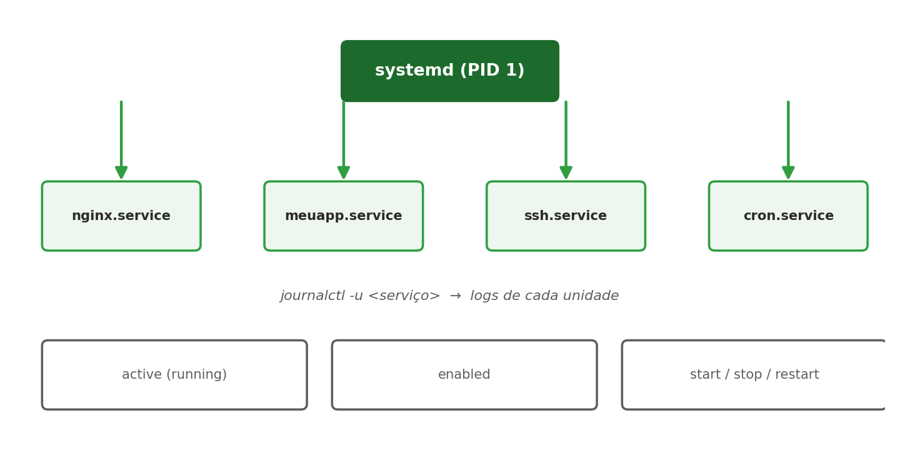

Principais conceitos:
- **Unit**: uma unidade gerenciável pelo systemd (serviço, timer, socket, etc.). Serviços usam a extensão `.service`.
- **Estado de execução**: `active (running)`, `inactive (dead)`, `failed`.
- **Habilitado (enabled)**: o serviço inicia automaticamente no boot, independentemente de estar rodando agora.

### Comandos essenciais — systemd

```bash
# Ver status de um serviço
sudo systemctl status ssh

# Iniciar, parar e reiniciar
sudo systemctl start ssh
sudo systemctl stop ssh
sudo systemctl restart ssh

# Habilitar/desabilitar no boot
sudo systemctl enable ssh
sudo systemctl disable ssh

# Listar todos os serviços ativos
systemctl list-units --type=service --state=running

# Ver logs de um serviço específico
journalctl -u ssh -f
```

### Criando um serviço próprio

Crie o arquivo `/etc/systemd/system/meuapp.service`:

```ini
[Unit]
Description=Minha aplicação de teste
After=network.target

[Service]
ExecStart=/usr/bin/python3 -m http.server 8000
Restart=on-failure
User=www-data

[Install]
WantedBy=multi-user.target
```

Depois:

```bash
sudo systemctl daemon-reload
sudo systemctl enable --now meuapp.service
sudo systemctl status meuapp.service
```

Teste se o serviço está realmente rodando:

```bash
ps -aux | grep http.server
```

Você deve ver um processo do Python rodando com o usuário `www-data`. Em seguida, abra o navegador (no Windows, se estiver no WSL2) e acesse:

```
http://localhost:8000
```

Se tudo estiver certo, o navegador vai mostrar a listagem de arquivos do diretório onde o serviço foi iniciado.

### Exercícios

1. Instale o pacote `apache2` (`sudo apt install apache2`) e pratique start/stop/restart/status.
2. Crie um serviço systemd customizado que rode um script shell simples (`/bin/sh -c 'echo "rodando em $(date +%Y-%m-%d_%H:%M:%S)" >> /tmp/log.txt'`) a cada execução.
3. Use `journalctl -u <serviço> --since "10 min ago"` para investigar os logs recentes de um serviço.
4. Desafio: faça um serviço falhar de propósito (ex.: aponte para um binário inexistente) e use `journalctl` para diagnosticar o erro.

---

## Complemento — Acesso SSH, rede básica e teste de conectividade

> Conteúdo de apoio às Semanas 2-3, usado sempre que for necessário acessar ou testar um servidor remotamente.

### Teoria

O **SSH (Secure Shell)** é o protocolo padrão para acesso remoto e seguro a servidores Linux — substitui protocolos antigos e não criptografados como Telnet. A autenticação pode ser feita por senha ou, de forma mais segura, por **par de chaves** (privada no cliente, pública no servidor).

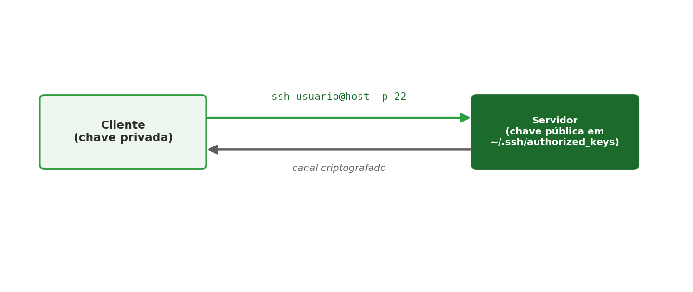

#### Par de chaves: pública e privada

A autenticação por chave usa **criptografia assimétrica**: em vez de uma única senha, são geradas duas chaves matematicamente relacionadas, mas com papéis diferentes:

- **Chave privada**: fica guardada apenas no computador do usuário (ex.: `~/.ssh/id_ed25519`). Nunca deve ser compartilhada, copiada para outra máquina ou enviada por e-mail/chat. É ela que "prova" a identidade do usuário.
- **Chave pública**: pode ser distribuída livremente (ex.: `~/.ssh/id_ed25519.pub`). É copiada para dentro do servidor, no arquivo `~/.ssh/authorized_keys` do usuário remoto.

O funcionamento, de forma simplificada:

1. O cliente pede para se conectar ao servidor.
2. O servidor verifica se existe, no `authorized_keys`, uma chave pública correspondente àquele cliente.
3. O servidor envia um desafio criptografado com a chave pública.
4. Só quem possui a **chave privada** correspondente consegue responder corretamente a esse desafio — sem nunca precisar transmitir a chave privada pela rede.

Por isso esse modelo é mais seguro que senha: mesmo que alguém intercepte toda a comunicação, não há uma senha trafegando que possa ser roubada, e a chave privada nunca sai da máquina do usuário.

> Boas práticas: proteja a chave privada com uma **passphrase** (senha adicional pedida ao usá-la), nunca a compartilhe, e use uma chave diferente por dispositivo/contexto quando possível.

Antes de acessar um servidor, também é importante saber **configurar e diagnosticar a rede**: qual IP a máquina possui, se ela enxerga a internet, se uma porta específica está acessível, etc.

### Comandos essenciais — SSH

No WSL2, o cliente e o servidor SSH normalmente estão na mesma distribuição Linux — por isso, em vez de um IP remoto, usamos `localhost`:

```bash
# 1. Instalar e habilitar o servidor SSH
sudo apt install openssh-server
sudo systemctl enable --now ssh
sudo systemctl status ssh

# 2. Gerar um par de chaves no cliente
ssh-keygen -t ed25519 -C "adriano@ifpe" -N ""
# O -N "" já define a passphrase como vazia, para um acesso totalmente sem senha
# (aceite o caminho padrão apertando Enter na pergunta do local do arquivo)

# 3. Copiar a chave pública para o servidor (autenticação sem senha)
ssh-copy-id seu_usuario@localhost
# Vai pedir a senha do usuário Linux uma última vez

# 4. Conectar — não deve mais pedir nem senha, nem passphrase
ssh seu_usuario@localhost
ssh seu_usuario@localhost -p 2222   # se a porta padrão foi alterada

# 5. Copiar arquivos via SSH (scp)
touch arquivo.txt
scp arquivo.txt adriano@127.0.0.1:~/
```

> **Já criou a chave com passphrase por engano e ela está sendo pedida a cada acesso?** Apague e gere de novo sem passphrase:
> ```bash
> rm ~/.ssh/id_ed25519 ~/.ssh/id_ed25519.pub
> ssh-keygen -t ed25519 -C "adriano@ifpe" -N ""
> ssh-copy-id seu_usuario@localhost
> ```
> Uma passphrase vazia é aceitável em ambiente de estudo/laboratório, mas não é recomendada em servidores de produção — lá, o ideal é manter a passphrase e usar um `ssh-agent` para não digitá-la a cada conexão.

> Se o objetivo for acessar um servidor de verdade em outra máquina da rede, basta trocar `localhost` pelo IP real do servidor (`usuario@192.168.x.x`) — o restante do processo é idêntico. Nesse caso, para acessar o WSL2 a partir de fora, também é preciso configurar port forwarding no Windows (`netsh interface portproxy`), já que o WSL2 usa uma rede NAT interna.

#### Usuários com sudo e por que evitar o root

O **root** é o superusuário do Linux — tem acesso irrestrito a todo o sistema. Usar o root diretamente no dia a dia (inclusive para logar via SSH) é uma prática desaconselhada, por alguns motivos:

- **Nenhum limite de segurança**: um erro de digitação em um comando como `rm -rf` executado como root pode destruir o sistema inteiro, sem qualquer proteção.
- **Rastreabilidade**: em um servidor com vários administradores, se todos usam a conta `root`, não dá para saber quem executou o quê. Com usuários individuais, cada ação fica associada a uma pessoa.
- **Superfície de ataque**: o nome de usuário `root` já é conhecido por qualquer atacante — é o primeiro login que tentativas automatizadas de invasão testam. Desabilitar o login SSH do root elimina esse alvo óbvio.

A prática recomendada é criar um **usuário comum com permissão de sudo** — ele executa o dia a dia normalmente como um usuário sem privilégios, e usa `sudo` apenas quando precisa de uma ação administrativa específica, comando a comando.

```bash
# Criar um novo usuário
sudo adduser henrique

# Adicionar esse usuário ao grupo sudo (Ubuntu/Debian)
sudo usermod -aG sudo henrique

# Confirmar que o usuário está no grupo
groups henrique
```

Depois disso, o usuário `henrique` pode rodar comandos administrativos prefixando com `sudo`:

```bash
sudo apt update
sudo systemctl restart nginx
```

**Testando o `PermitRootLogin`**

Por padrão, o acesso SSH via root já **não é permitido**. Antes de mudar qualquer coisa, teste isso na prática:

```bash
ssh root@localhost
```

Esse acesso deve ser recusado. Agora vamos habilitar temporariamente, só para comprovar o comportamento, e depois desfazer.

1. Edite o arquivo de configuração:
```bash
sudo nano /etc/ssh/sshd_config
```

2. Localize a linha `#PermitRootLogin`, remova o comentário e altere para `yes`:
```
PermitRootLogin yes
```

3. Reinicie o serviço e teste novamente:
```bash
sudo systemctl restart ssh.service
ssh root@localhost
```
Agora o acesso deve ser aceito (supondo que a senha do root esteja definida).

4. Volte a configuração para o padrão seguro, alterando de novo para `no`:
```
PermitRootLogin no
```

5. Reinicie o serviço mais uma vez para aplicar:
```bash
sudo systemctl restart ssh.service
```

> A partir desse ponto, qualquer acesso remoto precisa ser feito por um usuário nomeado com sudo — o que também facilita auditoria, já que cada ação fica associada a uma conta específica, e não a um "root" genérico e compartilhado.

### Comandos essenciais — configuração básica de rede

```bash
# Ver endereços IP da máquina
ip addr show
hostname -I          # atalho para o IP no WSL2

# Ver e alterar o hostname
hostname
sudo hostnamectl set-hostname meu-servidor

# Ver a tabela de rotas
ip route

# Ver servidores DNS configurados
cat /etc/resolv.conf
```

#### Configurando IP fixo no Ubuntu Server

> Esta seção vale para um **Ubuntu Server real ou em uma VM** (ex.: VirtualBox, Hyper-V, ou um servidor na nuvem) — o WSL2 gerencia sua própria rede virtual internamente e não usa esse método.

O Ubuntu Server (desde a versão 18.04) usa o **Netplan** para configurar rede, com arquivos YAML em `/etc/netplan/`.

1. Identifique o nome da sua interface de rede:
```bash
ip addr show
```
Normalmente algo como `eth0` ou `enp0s3`.

2. Veja o arquivo de configuração existente (o nome pode variar):
```bash
ls /etc/netplan/
sudo cat /etc/netplan/00-installer-config.yaml
```

3. Edite o arquivo para definir um IP fixo:
```bash
sudo nano /etc/netplan/00-installer-config.yaml
```

```yaml
network:
  version: 2
  ethernets:
    eth0:
      dhcp4: no
      addresses:
        - 192.168.1.50/24
      routes:
        - to: default
          via: 192.168.1.1
      nameservers:
        addresses: [8.8.8.8, 8.8.4.4]
```

> Atenção com a indentação no YAML — ela é obrigatória e sensível a espaços (não use tabs).

4. Aplique a configuração:
```bash
sudo netplan apply
```

5. Confirme que o novo IP foi atribuído:
```bash
ip addr show eth0
```

6. Teste a conectividade após a mudança:
```bash
ping -c 4 8.8.8.8
```

### Comandos essenciais — teste de conectividade

```bash
# Testar se um host responde (ICMP)
ping -c 4 google.com

# Testar se uma porta específica está aberta
nc -zv localhost 22
nc -zv localhost 80

# Ver conexões e portas em escuta na própria máquina
ss -tulpn

# Alternativa mais antiga (mas ainda muito usada) ao ss
netstat -natp

# Testar uma requisição HTTP diretamente do terminal
curl -I http://localhost

# Rastrear o caminho até um host (quando disponível no Linux/WSL2)
sudo apt install traceroute
traceroute google.com
```

### Exercícios

1. Habilite o servidor SSH no seu WSL2 e conecte-se a ele localmente usando `ssh usuario@localhost`.
2. Gere um par de chaves SSH e configure o acesso sem senha (`ssh-copy-id`) para o seu próprio usuário local.
3. Use `ss -tulpn` para identificar em quais portas o Nginx (Semana 6) e o SSH estão escutando.
4. Desafio: usando `nc -zv`, escreva um pequeno script que teste a conectividade de 3 portas diferentes (22, 80, 443) e informe quais estão abertas.

---

## Semana 3 — Permissões e sistema de arquivos

### Teoria

No Linux, cada arquivo tem um dono (**user**), um grupo (**group**) e permissões para "outros" (**others**). Cada uma dessas categorias pode ter permissão de leitura (**r**), escrita (**w**) e execução (**x**).

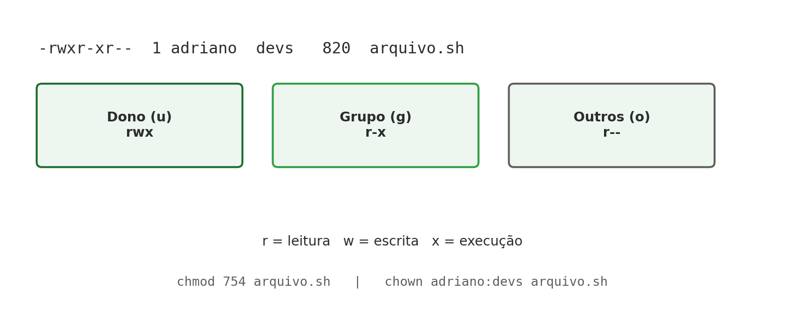

As permissões também podem ser representadas em formato octal:

| Permissão | Valor |
|---|---|
| `r` (leitura) | 4 |
| `w` (escrita) | 2 |
| `x` (execução) | 1 |

Assim, `rwx` = 4+2+1 = **7**, `r-x` = 4+1 = **5**, `r--` = 4.

Além das permissões básicas, o comando **`chown`** permite alterar o dono e/ou o grupo de um arquivo — essencial para organizar o acesso quando diferentes usuários ou grupos precisam interagir com os mesmos arquivos.

### Comandos essenciais

```bash
# Ver permissões detalhadas
ls -la

# Criar um arquivo de teste
touch arquivo.sh

# Alterar dono e grupo
sudo chown adriano:devs arquivo.sh

# Alterar permissões (modo octal)
chmod 754 arquivo.sh

# Alterar permissões (modo simbólico)
chmod u+x arquivo.sh
chmod g-w arquivo.sh

# Criar usuários e grupos
sudo useradd -m aluno1
sudo groupadd devs
sudo usermod -aG devs aluno1

# Ver todos os grupos existentes no sistema e seus membros
sudo cat /etc/group

# Trocar apenas o dono de um arquivo, mantendo o grupo
sudo chown aluno1 arquivo.sh

# Trocar apenas o grupo de um arquivo
sudo chown :devs arquivo.sh
```

### Exercícios

1. Crie uma pasta `/home/compartilhada`, com um grupo `devs`, e configure permissões para que apenas o grupo tenha acesso de escrita.
2. Crie dois usuários de teste e use `chown` para transferir a posse de um arquivo de um usuário para o outro.
3. Explique (por escrito, num arquivo `respostas.md`) a diferença entre `chmod 700` e `chmod 750` em um script.
4. Desafio: usando `find`, liste todos os arquivos do seu `$HOME` com permissão de escrita para "outros" (`o+w`) — um risco comum de segurança.

---

## Semana 4 — Armazenamento e monitoramento básico

### Teoria

O **LVM (Logical Volume Manager)** permite gerenciar armazenamento de forma flexível, agrupando discos físicos (**Physical Volumes**) em um **Volume Group**, e então criando **Logical Volumes** que podem ser redimensionados a quente.

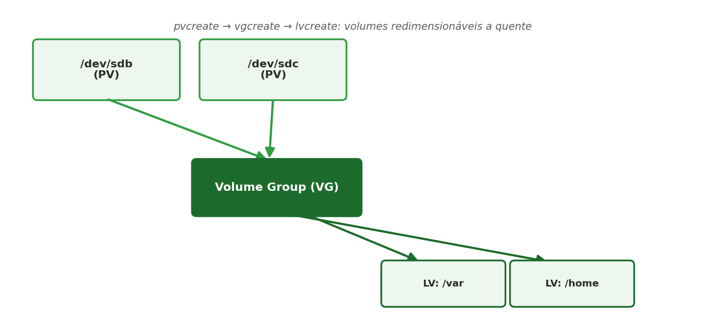

Os três conceitos-chave do LVM, na ordem em que se relacionam:

- **PV (Physical Volume)**: é a "matéria-prima" — um disco físico inteiro ou uma partição (no nosso caso, um loop device simulando um disco). Sozinho, ainda não é utilizável diretamente pelo LVM; é só a camada de entrada.
- **VG (Volume Group)**: é o "estoque" — um ou mais PVs são agrupados em um único VG, formando um "pool" de espaço de armazenamento combinado. É nesse nível que o espaço de discos diferentes passa a ser tratado como um único volume de armazenamento.
- **LV (Logical Volume)**: é o "produto final" — um pedaço de espaço "recortado" do VG, que é então formatado com um sistema de arquivos (ext4, por exemplo) e montado normalmente, como se fosse uma partição comum. É o LV que o sistema operacional realmente usa no dia a dia.

Ou seja, o caminho é sempre: **disco(s) → PV → VG → LV → sistema de arquivos → ponto de montagem**. A vantagem é que um LV pode ser redimensionado (`lvextend`) puxando espaço livre do VG, mesmo com o sistema em uso — algo que não é possível com uma partição tradicional.

No **WSL2** não existem múltiplos discos físicos disponíveis, então vamos simular usando **arquivos de disco** (loop devices) — os comandos de LVM são exatamente os mesmos que você usaria em um servidor real.

O **journalctl** é a ferramenta de consulta de logs do systemd — centraliza logs do kernel, de serviços e do próprio sistema em um único lugar, permitindo filtrar por serviço, período ou nível de severidade sem precisar caçar arquivos de log espalhados pelo sistema.

### Comandos essenciais — simulando discos no WSL2

```bash
# Criar dois arquivos de 1GB para simular discos
sudo apt install lvm2
sudo dd if=/dev/zero of=/disco1.img bs=1M count=1024
sudo dd if=/dev/zero of=/disco2.img bs=1M count=1024

# Associar os arquivos a loop devices
sudo losetup -fP /disco1.img
sudo losetup -fP /disco2.img
losetup -a   # confirme os nomes atribuídos, ex.: /dev/loop0, /dev/loop1
```

### Comandos essenciais — LVM

```bash
# Criar os Physical Volumes
sudo pvcreate /dev/loop0 /dev/loop1

# Criar o Volume Group
sudo vgcreate meu_vg /dev/loop0 /dev/loop1

# Criar Logical Volumes
sudo lvcreate -L 800M -n lv_dados meu_vg
sudo lvcreate -L 800M -n lv_backup meu_vg

# Formatar e montar
sudo mkfs.ext4 /dev/meu_vg/lv_dados
sudo mkdir /mnt/dados
sudo mount /dev/meu_vg/lv_dados /mnt/dados

# Acompanhar o espaço disponível em cada etapa
df -h

# Redimensionar a quente
sudo lvextend -L +200M /dev/meu_vg/lv_dados
sudo resize2fs /dev/meu_vg/lv_dados

# Conferir o novo tamanho refletido no sistema de arquivos
df -h
```

### Comandos essenciais — journalctl

```bash
# Logs do boot atual
journalctl -b

# Logs de um serviço específico
journalctl -u ssh

# Acompanhar logs em tempo real
journalctl -f

# Logs de um período específico
journalctl --since "2026-08-01" --until "2026-08-10"
```

### Exercícios

1. Simule dois discos, crie um Volume Group e um Logical Volume de 500MB, formate e monte em `/mnt/teste`.
2. Redimensione o Logical Volume criado para 700MB sem desmontá-lo.
3. Use `journalctl -p err` para listar apenas mensagens de erro do sistema.
4. Desafio: pesquise e explique a diferença entre um **snapshot de LVM** e um backup tradicional.

---

## Semana 5 — Shell scripting para automação

### Teoria

Shell scripts automatizam tarefas repetitivas de administração. Combinados ao **cron**, permitem agendar execuções automáticas em horários específicos.

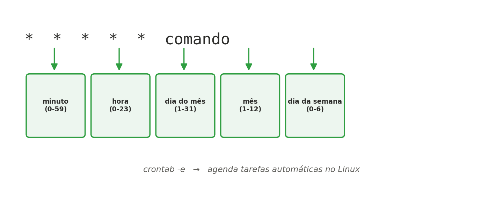

Estrutura básica de um script:

```bash
#!/bin/bash
# comentário explicando o script

VARIAVEL="valor"

if [ condição ]; then
    comando
fi

for item in lista; do
    comando "$item"
done

for item in arquivo1.txt arquivo2.txt arquivo3.txt; do
    cat "$item"
done
```

#### Criando variáveis de usuário

Além das variáveis de ambiente (vistas mais adiante nesta semana), você pode criar suas próprias variáveis dentro de um script — chamadas de **variáveis de usuário**. Elas guardam valores temporários usados apenas ali, como um número, um texto ou o resultado de um comando:

```bash
#!/bin/bash
# Teste de variáveis
idade=25
nome="Monica"
echo "A $nome tem $idade anos de idade"
```

Algumas regras importantes:
- **Sem espaços ao redor do `=`**: `idade=25` funciona, mas `idade = 25` dá erro (o Bash interpretaria `idade` como um comando).
- **Aspas em textos com espaço**: `nome="Monica Silva"` precisa de aspas; um valor sem espaços, como `idade=25`, não exige.
- **Para usar o valor de uma variável, sempre com `$` antes do nome**: `$nome`, `$idade` — a variável sem o `$` (`nome`, `idade`) se refere ao nome dela, não ao valor.
- Diferente das variáveis de ambiente, essas variáveis de usuário só existem dentro do próprio script (ou do shell onde foram criadas) — não são repassadas a outros programas, a menos que sejam explicitamente exportadas com `export`.

#### Arquivo de script

A primeira linha de um script — `#!/bin/bash` — é chamada de **shebang**. Ela indica ao sistema qual interpretador deve ser usado para executar aquele arquivo (nesse caso, o Bash). É por causa dela que você consegue rodar `./script.sh` diretamente, sem precisar digitar `bash script.sh` toda vez.

Depois de especificar o shell na primeira linha, o restante do arquivo é composto pelos comandos a serem executados, junto com os comentários necessários (qualquer linha iniciada por `#`, exceto a própria shebang, é ignorada pelo interpretador):

```bash
#!/bin/bash
# Este é meu primeiro script do bash
cd /
ls -l
```

Salve esse conteúdo como `primeiro_script.sh`, dê permissão de execução e rode:

```bash
chmod +x primeiro_script.sh
./primeiro_script.sh
```

**Por que a permissão de execução é necessária:** ter a shebang correta não é suficiente para rodar o script com `./nome_do_script.sh` — o arquivo também precisa ter a permissão de **execução (x)** ativada (lembrando da Semana 3), já que, para o Linux, um script é só um arquivo de texto como outro qualquer até que essa permissão seja concedida. Sem ela, tentar rodar `./script.sh` resulta em erro de "Permission denied":

```bash
# Ver se o script já tem permissão de execução
ls -l script.sh
# Se aparecer algo como -rw-r--r--, falta o "x" — sem permissão de execução

# Conceder permissão de execução
chmod +x script.sh

# Agora sim, o script pode ser executado diretamente
ls -l script.sh
# Deve aparecer -rwxr-xr-x (ou similar, com o "x" presente)
./script.sh
```

> Alternativa sem dar permissão de execução: é possível rodar o script chamando o interpretador diretamente, sem depender do `x` nem da shebang — `bash script.sh` ou `sh script.sh`. Mas o modo `./script.sh` é o mais usado no dia a dia, e por isso exige essa permissão.

### Comandos e exemplos

```bash
# Tornar um script executável
chmod +x script.sh
./script.sh
```

#### Argumentos de linha de comando

Todo script pode receber informações de fora, passadas na hora de chamá-lo:

```bash
#!/bin/bash
echo "Nome do script: $0"
echo "Primeiro argumento: $1"
echo "Segundo argumento: $2"
echo "Todos os argumentos: $@"
echo "Quantidade de argumentos: $#"
```

Rodando `./script.sh servidor1 producao`, o resultado seria:
```
Nome do script: ./script.sh
Primeiro argumento: servidor1
Segundo argumento: producao
Todos os argumentos: servidor1 producao
Quantidade de argumentos: 2
```

- `$0` — o nome do próprio script.
- `$1`, `$2`, ... — os argumentos individuais, na ordem em que foram passados.
- `$@` — todos os argumentos, como uma lista.
- `$#` — quantos argumentos foram passados (útil para validar se o script recebeu o que precisava antes de continuar).

#### Variáveis de ambiente

Uma variável comum (`VARIAVEL="valor"`) só existe dentro do shell ou script onde foi criada. Já uma **variável de ambiente** funciona como uma "variável global": fica disponível para todos os subprocessos daquele shell, incluindo outros programas e scripts que ele venha a chamar.

Alguns exemplos de variáveis de ambiente já existentes no sistema:

| Variável | O que é |
|---|---|
| `PATH` | Lista de diretórios onde o shell procura por programas executáveis |
| `USERNAME` | Nome do usuário logado |
| `TERM` | Tipo de terminal ou janela de terminal em uso |
| `HOME` | Diretório home do usuário atual |
| `UID` | UID (identificador numérico) do usuário atual |
| `RANDOM` | Gera um número aleatório a cada vez que é lida |
| `LANG` | Idioma configurado, especificado como *locale* |

```bash
# Ver o valor de uma variável de ambiente específica
echo $HOME
echo $PATH

# Listar todas as variáveis de ambiente do terminal atual
env
printenv

# Ver só uma variável específica com printenv
printenv LANG
```

**Usando variáveis de ambiente dentro de um script:** como já são conhecidas pelo shell, essas variáveis podem ser lidas diretamente em qualquer script, sem precisar declará-las antes:

```bash
#!/bin/bash
# Informações sobre o usuário:
echo "Usuário: $USER"
echo "Diretório home: $HOME"
echo "UID do usuário: $UID"
```

Rodando esse script, a saída mostra os valores já preenchidos automaticamente pelo sistema, sem que o script precise perguntar nada ao usuário — por exemplo:
```
Usuário: adriano
Diretório home: /home/adriano
UID do usuário: 1000
```

Isso é bastante útil para escrever scripts que se adaptam automaticamente a quem os executa, sem valores fixos ("hardcoded") no meio do código.

**Criando uma variável de ambiente própria:** por padrão, toda variável que você cria (`MINHA_VAR="valor"`) é local ao shell atual — se você chamar um script ou outro programa a partir dali, ele não vai enxergar essa variável. Para torná-la uma variável de ambiente (visível também pelos subprocessos), use o comando `export`:

```bash
# Cria uma variável local
AMBIENTE="producao"

# Torna essa variável visível também para subprocessos (scripts, programas chamados a partir daqui)
export AMBIENTE

# Ou nas duas linhas de uma vez
export AMBIENTE="producao"
```

Isso é bastante usado, por exemplo, para configurar variáveis que um script precisa ler (`export DB_HOST="localhost"`) sem precisar passá-las como argumento toda vez.

**Mas isso vale só para a sessão atual do terminal** — feche o terminal e a variável `export`ada desaparece. Para que uma variável de ambiente (ou qualquer configuração) esteja sempre disponível, ela precisa ser colocada em um dos **arquivos de inicialização** do shell, que o Bash lê automaticamente em momentos específicos:

| Arquivo | Uso |
|---|---|
| `/etc/profile` | Arquivo de inicialização, executado durante o login e válido para todo o sistema; contém variáveis de ambiente e programas de inicialização |
| `/etc/bashrc` ou `/etc/bash.bashrc` | Arquivo de inicialização, válido para todo o sistema, executado pelo `.bashrc` do usuário para cada shell bash iniciado. Contém funções e aliases |
| `~/.bash_profile` | Se existir, será executado após `/etc/profile` durante o login |
| `~/.bash_login` | Se o `.bash_profile` não existir, será executado automaticamente durante o login |
| `~/.profile` | Se nenhum dos dois anteriores existir, será executado automaticamente no login |
| `~/.bashrc` | Executado automaticamente quando o bash é iniciado interativamente |
| `~/.inputrc` | Contém variáveis e configurações do modo de operação do bash em relação às teclas (vinculação) |
| `~/.bash_logout` | Executado automaticamente no logout |

Na prática, o mais comum no dia a dia é editar o `~/.bashrc` (para configurações do próprio usuário, que valem em qualquer shell interativo que ele abrir) ou o `/etc/profile` (quando a configuração deve valer para todos os usuários do sistema):

```bash
# Editar o .bashrc do usuário atual
nano ~/.bashrc

# Adicione ao final do arquivo, por exemplo:
export EDITOR=nano
export DB_HOST=localhost

# Aplique sem precisar abrir um novo terminal
source ~/.bashrc
```

> O comando `source` (ou o atalho `.`) executa o conteúdo de um arquivo no shell atual, sem precisar abrir uma nova sessão — é assim que se testa uma alteração no `.bashrc` imediatamente.

#### Operadores de comparação

Dentro de um `if`, o tipo de comparação muda dependendo se você está comparando números ou textos:

```bash
# Comparação numérica
if [ "$IDADE" -eq 18 ]; then echo "tem exatamente 18"; fi
if [ "$IDADE" -gt 18 ]; then echo "maior que 18"; fi
if [ "$IDADE" -lt 18 ]; then echo "menor que 18"; fi

# Comparação de texto (string)
if [ "$AMBIENTE" = "producao" ]; then echo "é produção"; fi
if [ "$AMBIENTE" != "producao" ]; then echo "não é produção"; fi
```

| Numérico | Significado | String | Significado |
|---|---|---|---|
| `-eq` | igual | `=` | igual |
| `-ne` | diferente | `!=` | diferente |
| `-gt` | maior que | | |
| `-lt` | menor que | | |
| `-ge` | maior ou igual | | |
| `-le` | menor ou igual | | |

**`[ ]` vs `[[ ]]`**: `[ ]` é a sintaxe mais antiga e portátil (funciona em qualquer shell POSIX), mas é mais rígida — exige aspas cuidadosas em torno de variáveis para não quebrar com espaços ou strings vazias. `[[ ]]` é uma extensão do Bash, mais segura e flexível: permite operadores como `&&`/`||` diretamente dentro dos colchetes, comparação de padrões (`[[ $ARQUIVO == *.log ]]`) e é mais tolerante a variáveis vazias ou com espaços. Na prática, em scripts que só vão rodar em Bash (a maioria dos casos em servidores Linux modernos), prefira `[[ ]]`.

#### Decisão condicional: If-Then-Else

A estrutura condicional completa do Bash segue este formato geral:

```bash
if comando
then
    comandos
else
    outros comandos
fi
```

O **condicional composto** (`if...then...else...fi`) permite executar um bloco de código caso o comando testado retorne código de status zero (sucesso), e outro bloco de código caso retorne status diferente de zero (erro). O `else` é opcional — quando omitido, se o comando falhar, o `if` simplesmente não executa nada e segue para a linha depois do `fi`.

#### If-Then: testando o resultado de um comando diretamente

Todos os exemplos acima usam `[ ]` ou `[[ ]]` para testar uma condição. Mas o `if` não exige isso — ele pode testar **qualquer comando**, usando diretamente o código de saída dele (o `$?` visto na seção de exit codes): se o comando terminar com `0` (sucesso), o `if` é considerado verdadeiro; qualquer outro valor é considerado falso.

```bash
#!/bin/bash
# Exemplo de condicional simples em um script
if cd /
then
    echo "Diretório raiz encontrado!"
fi
```

Aqui, `cd /` é o próprio teste: se o comando `cd /` conseguir executar (o diretório existe e há permissão de acesso), ele retorna `0` e o bloco `then` roda. Se `cd /` falhar por algum motivo, o `if` é considerado falso e o `echo` não é executado — sem precisar de nenhum `[ ]` ou comparação explícita.

Esse padrão é muito comum na prática, por exemplo para verificar se um comando foi bem-sucedido antes de continuar:

```bash
if ping -c 1 google.com &> /dev/null
then
    echo "Internet disponível"
else
    echo "Sem conexão"
fi
```

> Repare que isso é exatamente o mesmo mecanismo por trás do `&&` e `||` vistos em "Execução condicional em pipeline" — o `if` só está tornando essa lógica mais legível quando há vários comandos ou um bloco maior de código a executar.

#### Códigos de saída (exit codes)

Todo comando ou script, ao terminar, retorna um **código de saída**: `0` significa sucesso, qualquer valor de `1` a `255` significa algum tipo de erro (o número específico geralmente indica o motivo).

```bash
# Ver o código de saída do último comando executado
ls /pasta/que/nao/existe
echo $?    # deve mostrar um valor diferente de 0

# Forçar um código de saída específico no fim de um script
if [ ! -d "/mnt/dados" ]; then
    echo "Erro: diretório não encontrado" >&2
    exit 1
fi

echo "Tudo certo"
exit 0
```

**Status de saída: alguns significados**

Embora um script possa definir livremente seus próprios códigos (como o `exit 1` do exemplo acima), alguns valores têm um significado padronizado no Linux, gerado automaticamente pelo próprio shell em certas situações:

| Código | Significado |
|---|---|
| `0` | Comando completado com sucesso |
| `1` | Erro geral desconhecido |
| `126` | O comando não pode ser executado (permissões) |
| `127` | Comando não encontrado |
| `130` | Comando finalizado com Ctrl + C |

Para ver o código de status de um comando, digite `echo $?` logo após o término de sua execução:

```bash
# Exemplo do código 127 — comando que não existe
comando_inexistente
echo $?
# 127

# Exemplo do código 126 — script sem permissão de execução
./script_sem_permissao.sh
echo $?
# 126
```

Isso importa porque outros programas — inclusive o próprio cron, ou uma pipeline de CI/CD que veremos na Unidade 2 — decidem o que fazer a seguir com base nesse código. Um script que sempre retorna `0`, mesmo quando algo deu errado internamente, engana quem depende dele: um alerta que deveria disparar não dispara, uma pipeline que deveria parar continua. Todo script bem escrito deve refletir corretamente, no seu código de saída, se a tarefa foi concluída com sucesso ou não.

#### Manipulação de texto

Ferramentas clássicas de linha de comando para filtrar e transformar texto — extremamente úteis para analisar logs e saídas de outros comandos:

```bash
# grep — buscar linhas que casam com um padrão
grep "error" /var/log/syslog
grep -i "error" /var/log/syslog        # ignora maiúsculas/minúsculas
grep -c "error" /var/log/syslog        # conta quantas ocorrências

# grep -E — expressões regulares estendidas
grep -E "error|fail|critical" /var/log/syslog
grep -E "^[0-9]{3}" acessos.log        # linhas que começam com 3 dígitos

# sed — substituir texto
sed 's/error/ERRO/g' arquivo.log       # troca todas as ocorrências
sed -i 's/producao/homologacao/g' config.txt   # edita o arquivo diretamente (-i)

# awk — processar texto por colunas
awk '{print $1}' acessos.log           # imprime só a primeira coluna
awk -F, '{print $2}' dados.csv         # usa vírgula como separador de coluna

# cut — extrair pedaços de cada linha
cut -d: -f1 /etc/passwd                # extrai o 1º campo, separado por ":"

# sort e uniq — ordenar e remover duplicatas
sort nomes.txt
sort nomes.txt | uniq                  # remove linhas duplicadas adjacentes
sort nomes.txt | uniq -c               # conta quantas vezes cada linha aparece
```

Essas ferramentas são frequentemente combinadas em **pipeline** (usando `|`) para compor análises mais complexas — por exemplo, listar os 5 IPs que mais acessaram um servidor:

```bash
awk '{print $1}' acesso.log | sort | uniq -c | sort -rn | head -5
```

#### Here-documents

Um **here-document** (`<<EOF ... EOF`) permite gerar um bloco de texto (ou um arquivo inteiro) diretamente de dentro de um script, sem precisar de vários `echo` separados — muito usado para gerar arquivos de configuração:

```bash
#!/bin/bash
cat <<EOF > /etc/nginx/sites-available/meusite
server {
    listen 80;
    server_name $DOMINIO;
    root /var/www/meusite;
}
EOF

echo "Configuração criada para $DOMINIO"
```

Repare que variáveis como `$DOMINIO` são expandidas normalmente dentro do bloco — o que torna possível gerar configurações dinâmicas a partir de um template.

#### Execução condicional em pipeline

Além do `if`, é comum encadear comandos diretamente na linha, decidindo o que roda a seguir com base no sucesso ou falha do comando anterior:

```bash
# && — só executa o próximo comando se o anterior teve sucesso (exit code 0)
mkdir /mnt/backup && echo "Pasta criada com sucesso"

# || — só executa o próximo comando se o anterior FALHOU
ping -c 1 servidor.com || echo "Servidor não respondeu"

# ; — executa os comandos em sequência, independente do resultado do anterior
cd /tmp; ls; pwd
```

Isso é uma forma compacta de tratamento de erro, muito usada em scripts curtos e em pipelines de CI/CD:

```bash
sudo systemctl restart nginx && echo "Nginx reiniciado" || echo "Falha ao reiniciar o Nginx"
```

#### Formatação do comando `date`

O comando `date` exibe a data e hora atuais, mas o mais útil em scripts é poder **formatá-lo** — por exemplo, para nomear arquivos de backup ou registrar quando algo aconteceu em um log. Isso é feito com `date +FORMATO`, usando códigos precedidos de `%`:

| Código | Significado | Exemplo |
|---|---|---|
| `%Y` | Ano com 4 dígitos | 2026 |
| `%y` | Ano com 2 dígitos | 26 |
| `%m` | Mês (01-12) | 08 |
| `%d` | Dia do mês (01-31) | 27 |
| `%H` | Hora (00-23) | 14 |
| `%M` | Minuto (00-59) | 30 |
| `%S` | Segundo (00-59) | 05 |

Esses códigos são combinados livremente para montar o formato que você quiser:

```bash
# Data no formato ano-mês-dia
date +%Y-%m-%d
# 2026-08-27

# Data e hora, separadas por underline (bom para nomes de arquivo)
date +%Y-%m-%d_%H-%M-%S
# 2026-08-27_14-30-05

# Só a hora, no formato hora:minuto
date +%H:%M
# 14:30
```

> Repare que não pode haver espaço entre o `+` e o formato, nem dentro do formato (se precisar de um espaço no resultado, use aspas: `date "+%Y-%m-%d %H:%M"`).

Isso é exatamente o que torna possível nomear cada backup com um "timestamp" único, como no exemplo a seguir:

Exemplo — script de backup simples (`backup.sh`):

```bash
#!/bin/bash
DATA=$(date +%Y-%m-%d_%H-%M)
ORIGEM="/home/adriano/dados"
DESTINO="/home/adriano/backups/backup_$DATA.tar.gz"

tar -czf "$DESTINO" "$ORIGEM"
echo "Backup criado em $DESTINO"
```

Agendando com cron:

```bash
crontab -e
```

Adicione a linha (executa todo dia às 2h da manhã):

```
0 2 * * * /home/adriano/backup.sh >> /home/adriano/backup.log 2>&1
```

#### Mais exemplos de scripts

**Exemplo — verificando se um serviço está no ar (`checar_servico.sh`):**

```bash
#!/bin/bash
# Verifica se um serviço systemd está ativo; caso não esteja, tenta reiniciar

SERVICO="$1"

if [ "$#" -eq 0 ]; then
    echo "Uso: ./checar_servico.sh <nome-do-servico>"
    exit 1
fi

if systemctl is-active --quiet "$SERVICO"; then
    echo "$SERVICO está rodando normalmente."
    exit 0
else
    echo "$SERVICO está parado. Tentando reiniciar..."
    sudo systemctl restart "$SERVICO"
    exit $?
fi
```

**Exemplo — criando múltiplos usuários a partir de uma lista (`criar_usuarios.sh`):**

```bash
#!/bin/bash
# Lê uma lista de nomes de um arquivo e cria um usuário para cada um

ARQUIVO="$1"

if [ ! -f "$ARQUIVO" ]; then
    echo "Arquivo $ARQUIVO não encontrado."
    exit 1
fi

while read -r NOME; do
    if id "$NOME" &>/dev/null; then
        echo "Usuário $NOME já existe, pulando."
    else
        sudo useradd -m "$NOME"
        echo "Usuário $NOME criado."
    fi
done < "$ARQUIVO"
```

**Exemplo — monitor simples de espaço em disco com alerta (`monitor_disco.sh`):**

```bash
#!/bin/bash
# Verifica o uso do disco raiz e alerta se ultrapassar o limite definido

LIMITE=80
USO=$(df / | tail -1 | awk '{print $5}' | tr -d '%')

if [ "$USO" -ge "$LIMITE" ]; then
    echo "$(date): ALERTA - uso de disco em ${USO}%, acima do limite de ${LIMITE}%." >> /var/log/monitor_disco.log
    exit 1
else
    echo "$(date): uso de disco em ${USO}%, dentro do normal." >> /var/log/monitor_disco.log
    exit 0
fi
```

> Lembre-se: assim como no `primeiro_script.sh`, todos esses exemplos precisam de `chmod +x` antes de poderem ser rodados com `./nome_do_script.sh` — por exemplo, `chmod +x monitor_disco.sh`.

### Exercícios

1. Escreva um script que verifique o uso de disco (`df -h`) e envie um alerta (`echo` em um arquivo de log) se o uso passar de 80%. Faça o script terminar com `exit 1` se disparou o alerta, e `exit 0` caso contrário.
2. Agende esse script para rodar a cada 15 minutos usando cron.
3. Escreva um script que receba um nome de pasta como argumento (`$1`) e conte quantos arquivos existem dentro dela. Se nenhum argumento for passado (`$#` igual a 0), o script deve exibir uma mensagem de uso e sair com `exit 1`.
4. Use `grep -E`, `awk` e `sort`/`uniq` para encontrar, num arquivo de log, quais são as 3 mensagens de erro mais frequentes.
5. Desafio: crie um script que rotacione logs — renomeie `app.log` para `app.log.antigo` e crie um `app.log` vazio, apenas se o arquivo atual passar de 1MB. Use um here-document para registrar, num arquivo de relatório, a data e o motivo da rotação.

---

## Semana 6 — Introdução a servidores web

### Teoria

O protocolo **HTTP** define como clientes (navegadores) e servidores web trocam informações: o cliente envia uma **requisição** (ex.: `GET /index.html`) e o servidor responde com um **status code** e o conteúdo solicitado.

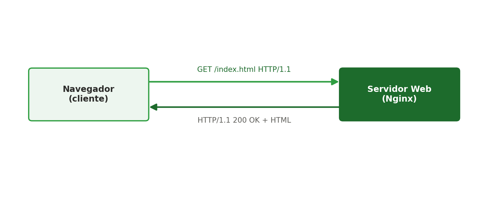

O **Nginx** e o **Apache** são os servidores web mais usados no mercado. O Nginx se destaca por lidar melhor com muitas conexões simultâneas e é frequentemente usado também como **proxy reverso** — um papel adicional que ele desempenha muito bem, e que vamos explorar na próxima semana.

#### Apache x Nginx: a diferença na arquitetura

A principal diferença entre os dois está em como cada um lida internamente com múltiplas requisições chegando ao mesmo tempo:

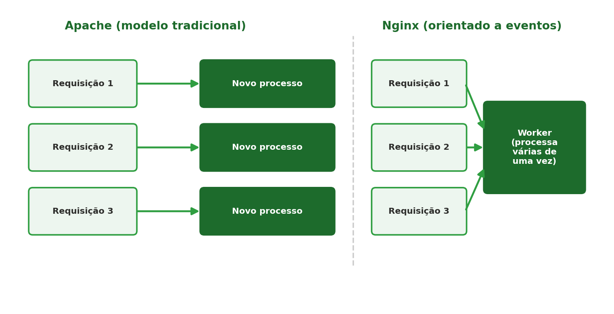

- **Apache (modelo tradicional)**: no modo mais comum (MPM `prefork`), o Apache lança um **novo processo (ou thread) dedicado para cada requisição**. Isso é simples de entender e configurar, mas cada processo consome memória própria — com muitas conexões simultâneas, o servidor pode consumir bastante RAM e ficar mais lento para abrir/gerenciar tantos processos.
- **Nginx (orientado a eventos)**: em vez de um processo por requisição, o Nginx **trabalha com um número fixo de *workers*** (processos), e cada worker consegue atender **várias requisições ao mesmo tempo**, de forma assíncrona e não bloqueante — sem precisar criar um processo novo a cada conexão. É por isso que o Nginx costuma lidar melhor com um volume grande de conexões simultâneas, usando bem menos memória para isso.

Essa diferença de arquitetura explica boa parte das decisões práticas do mercado: o Nginx é frequentemente colocado na "porta de entrada" (servindo arquivos estáticos, fazendo proxy reverso, balanceamento de carga), enquanto o Apache continua muito usado onde sua flexibilidade de módulos (como o `.htaccess`) é mais valorizada — por exemplo, em hospedagens compartilhadas.

> Vídeo recomendado sobre o assunto: [Apache x Nginx](https://www.youtube.com/watch?v=gd_cUmwzgEM)

### Comandos essenciais

```bash
# Instalar o Nginx no WSL2
sudo apt update
sudo apt install nginx

# Como o WSL2 não usa systemd habilitado por padrão em algumas versões, inicie manualmente se necessário:
sudo service nginx start
# ou, com systemd habilitado (ver seção inicial deste material):
sudo systemctl start nginx
sudo systemctl enable nginx
```

Página padrão fica em `/var/www/html/index.nginx-debian.html`. Para servir sua própria página:

```bash
sudo nano /var/www/html/index.html
```

```html
<!DOCTYPE html>
<html lang="en">
<head>
    <meta charset="UTF-8">
    <meta name="viewport" content="width=device-width, initial-scale=1.0">
    <title>Hello World</title>
    <style>
        body {
            font-family: Arial, sans-serif;
            display: flex;
            justify-content: center;
            align-items: center;
            min-height: 100vh;
            margin: 0;
            background: linear-gradient(135deg, #667eea 0%, #764ba2 100%);
        }
        .container {
            text-align: center;
            background: white;
            padding: 2rem;
            border-radius: 10px;
            box-shadow: 0 4px 6px rgba(0, 0, 0, 0.1);
        }
        h1 {
            color: #333;
            margin: 0;
            font-size: 3rem;
        }
        p {
            color: #666;
            margin-top: 1rem;
            font-size: 1.2rem;
        }
    </style>
</head>
<body>
    <div class="container">
        <h1>Hello, World!</h1>
        <p>Welcome to your first web page</p>
    </div>
</body>
</html>
```

Acesse pelo navegador do Windows: `http://localhost`

#### Entendendo o arquivo de configuração default

Quando usamos o comando

```bash
nginx -h
```

para verificar os detalhes do Nginx que acabamos de instalar na nossa máquina, vamos observar o local onde ele foi instalado e onde está o arquivo de configuração default que nosso servidorzinho está usando.

> No **WSL2/Ubuntu** (o ambiente deste material), esse arquivo fica em `/etc/nginx/nginx.conf`, diferente do caminho que aparece em instalações via Homebrew no macOS (`/opt/homebrew/etc/nginx/nginx.conf`) — o conteúdo e a lógica do arquivo, porém, são praticamente os mesmos.

```bash
/opt/homebrew/etc/nginx/nginx.conf
```

Veremos que ele se parece com o seguinte:

```nginx
worker_processes  1;

events {
    worker_connections  1024;
}

http {
    include       mime.types;
    default_type  application/octet-stream;

    sendfile        on;

    keepalive_timeout  65;

    server {
        listen       8080;
        server_name  localhost;

        location / {
            root   html;
            index  index.html index.htm;
        }

        error_page   500 502 503 504  /50x.html;
        location = /50x.html {
            root   html;
        }
    }

    include servers/*;
}
```

**Entendendo as configurações**

- **`worker_processes`** — Define o número de processos de trabalho (workers) que o Nginx vai iniciar. Geralmente é definido igual ao número de núcleos de CPU disponíveis, mas aqui está fixado em 1.
- **`worker_connections`** — Define configurações relacionadas aos eventos. O `worker_connections` determina o número máximo de conexões simultâneas que cada processo worker pode aceitar.
- **`http {`** — Início do bloco de configuração do módulo HTTP, que gerencia requisições web.
- **`include mime.types;`** — Inclui o arquivo `mime.types`, que associa extensões de arquivos a tipos MIME, permitindo que o Nginx envie o `Content-Type` correto nas respostas.
- **`default_type application/octet-stream;`** — Define o tipo MIME padrão para arquivos cuja extensão não foi reconhecida. `application/octet-stream` é usado para dados binários genéricos.
- **`sendfile on;`** — Ativa o uso do `sendfile()`, uma chamada de sistema eficiente para envio de arquivos, melhorando a performance.
- **`keepalive_timeout 65;`** — Define o tempo (em segundos) que a conexão ficará aberta aguardando novas requisições antes de ser encerrada.
- **`server {`** — Início do bloco que define um servidor virtual (host).
- **`listen 8080;`** — O servidor irá escutar a porta 8080 por conexões HTTP.
- **`server_name localhost;`** — Define o nome do servidor (hostname) para correspondência com o `Host` da requisição. Neste caso, aceita apenas `localhost`.
- **`location /`** — Define o comportamento para as requisições que chegarem na raiz do `server_name` (`/`).
  - **`root html;`** — Os arquivos serão servidos a partir da pasta `html`.
  - **`index index.html index.htm;`** — Caso não seja especificado um arquivo, tentará carregar `index.html` ou `index.htm`.
- **`error_page 500 502 503 504 /50x.html;`** — Define uma página de erro customizada para os códigos de erro 500, 502, 503 e 504. Redireciona para o caminho `/50x.html`.
- **`location = /50x.html {`** — Especifica onde está localizado o arquivo `/50x.html` no sistema de arquivos, que será servido a partir da pasta `html`.
- **`include servers/*;`** — Inclui todos os arquivos de configuração dentro do diretório `servers/`. Útil para organizar múltiplos blocos `server` separados.

### Exercícios

1. Instale o Nginx e publique uma página HTML estática simples com seu nome e a disciplina.
2. Altere a porta padrão do Nginx (de 80 para 8080) editando `/etc/nginx/sites-available/default` e reinicie o serviço.
3. Rode `nginx -h` e localize, no seu WSL2, onde ficam o binário do Nginx e o arquivo `nginx.conf`.
4. Desafio: instale também o Apache (`apache2`) em outra porta e mantenha os dois rodando simultaneamente sem conflito; compare, em texto, uma vantagem e uma desvantagem do Nginx frente ao Apache.

---

## Semana 7 — Proxy reverso

### Teoria

Um **proxy reverso** fica entre o cliente e um ou mais servidores de aplicação, recebendo as requisições e encaminhando-as para o backend correto — sem que o cliente saiba diretamente com qual servidor está falando. Isso é diferente de um **proxy comum (de encaminhamento)**, que fica do lado do cliente: várias máquinas cliente passam por ele para acessar a internet, e é o cliente quem fica "escondido" do servidor de destino.

#### Proxy convencional

Um **proxy convencional** fica posicionado entre os computadores de uma rede local e a internet — todo o tráfego de saída passa por ele antes de sair para fora:

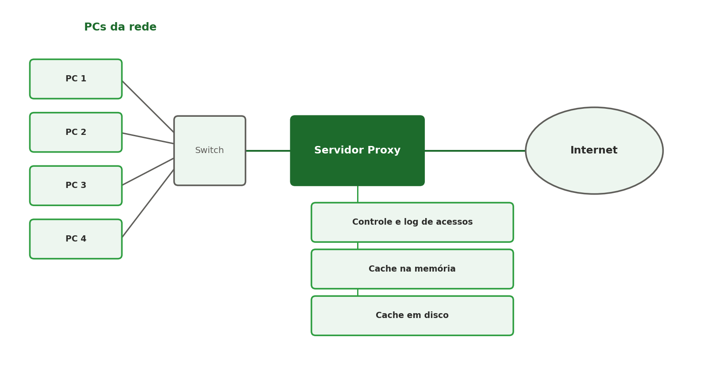

Colocado nesse ponto da rede, o proxy convencional normalmente oferece:

- **Controle e log de acessos**: registra quais sites/serviços cada máquina da rede acessou, e pode bloquear acesso a determinados endereços — muito usado em redes corporativas e escolares para aplicar políticas de uso da internet.
- **Cache na memória**: guarda temporariamente, na RAM, conteúdos muito acessados (páginas, arquivos), entregando-os instantaneamente para o próximo PC que pedir o mesmo conteúdo, sem precisar buscar de novo na internet.
- **Cache em disco**: parecido com o cache em memória, mas para conteúdos maiores ou menos acessados, guardados no disco do servidor proxy — mais lento que a memória, porém com muito mais capacidade de armazenamento.

Além de acelerar o acesso (pelo cache) e dar visibilidade/controle sobre o uso da rede (pelos logs), o proxy convencional também permite que muitas máquinas compartilhem um único ponto de saída para a internet — o que facilita aplicar regras de segurança (firewall, filtros de conteúdo) de forma centralizada, em vez de configurar cada PC individualmente.

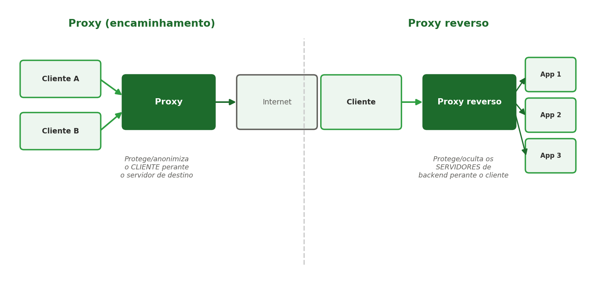

Em resumo: um **proxy comum protege/anonimiza o cliente**; um **proxy reverso protege/oculta os servidores de backend**. O Nginx, no papel de proxy reverso, fica do lado do servidor — é essa configuração que vamos montar nesta semana.

Pensando no fluxo completo de uma requisição real na internet, o proxy reverso fica posicionado assim:

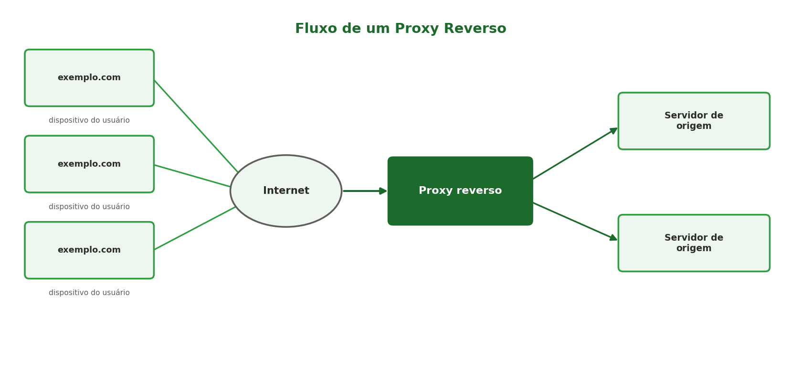

Vários dispositivos de usuários acessam o mesmo endereço (`exemplo.com`) pela internet; a requisição chega ao proxy reverso, que decide para qual **servidor de origem** (a aplicação de fato) encaminhar cada uma — os usuários nunca sabem, nem precisam saber, com qual servidor de origem estão realmente falando.

No nosso ambiente de estudo, o Nginx desempenha exatamente esse papel de proxy reverso, encaminhando as requisições para a aplicação rodando localmente:

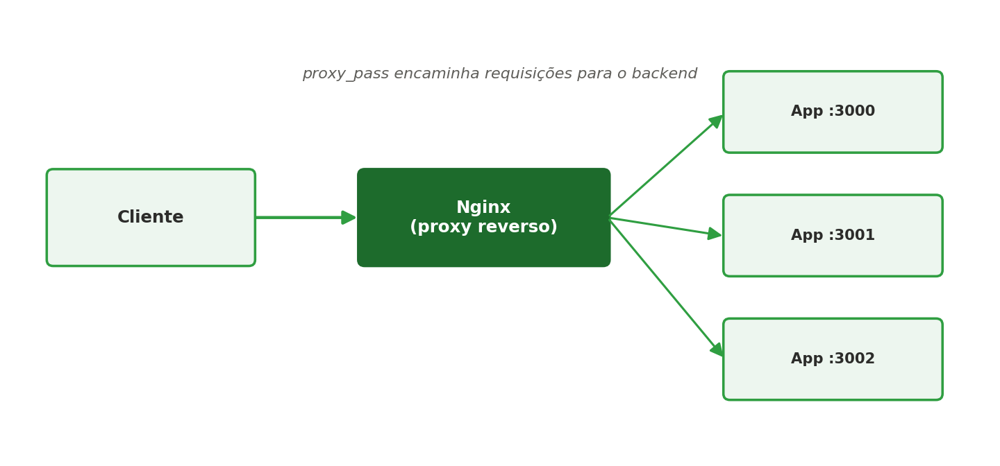

Isso é útil para: distribuir carga entre múltiplas instâncias, ocultar a estrutura interna da infraestrutura, centralizar configurações de segurança (como o TLS, visto na próxima semana), aplicar cache e compressão antes de a requisição chegar à aplicação, e padronizar logs de acesso num único ponto.

### Comandos e configuração — proxy reverso

Suba uma aplicação simples para servir de backend (ex.: um servidor HTTP em Python):

```bash
mkdir ~/app-teste && cd ~/app-teste
python3 -m http.server 3000
```

Configure o Nginx como proxy reverso, editando `/etc/nginx/sites-available/default`:

```nginx
server {
    listen 80;
    server_name localhost;

    location / {
        proxy_pass http://127.0.0.1:3000;
        proxy_set_header Host $host;
        proxy_set_header X-Real-IP $remote_addr;
    }
}
```

Aplique a configuração:

```bash
sudo nginx -t          # testa a sintaxe antes de aplicar
sudo systemctl reload nginx
```

**`systemctl reload` x `nginx -s reload`**: até aqui usamos `systemctl reload nginx`, que pede ao *systemd* para recarregar o serviço. Existe também uma forma de pedir isso **diretamente ao próprio binário do Nginx**, sem passar pelo systemd:

```bash
sudo nginx -s reload
```

Os dois fazem, na prática, a mesma coisa: recarregam os arquivos de configuração **sem derrubar as conexões já em andamento** (diferente de um `restart`, que reinicia o processo inteiro). A diferença é só a "porta de entrada":

- `systemctl reload nginx` — passa pelo systemd, que sabe controlar o serviço (start/stop/enable) mesmo que o Nginx não esteja rodando corretamente; é a forma recomendada quando o Nginx está rodando como serviço gerenciado pelo systemd (como fizemos até aqui).
- `nginx -s reload` — fala diretamente com o processo mestre do Nginx (`-s` de *signal*, envia o sinal internamente). Funciona em qualquer instalação, mesmo sem systemd — é o comando mais comum em ambientes onde o Nginx foi instalado "na mão" (ex.: compilado do código-fonte) ou em sistemas como macOS com Homebrew, onde não há systemd.

Outros sinais aceitos por `nginx -s`:

```bash
sudo nginx -s stop      # para o Nginx imediatamente (sem esperar requisições em andamento)
sudo nginx -s quit      # para o Nginx graciosamente (espera terminar o que já estava em andamento)
sudo nginx -s reopen    # reabre os arquivos de log (útil após rotacioná-los)
```

> No nosso ambiente (WSL2 com systemd habilitado), prefira `systemctl reload/restart nginx` no dia a dia — é a forma mais alinhada com o resto do material (Semana 2). Mas vale saber que `nginx -s` existe e funciona igual, pois é comum encontrá-lo em documentações e tutoriais que não usam systemd.

### Balanceamento de carga com `upstream`

Quando existe mais de uma instância da mesma aplicação rodando (ex.: para suportar mais tráfego ou permitir atualizações sem downtime), o Nginx pode distribuir as requisições entre elas usando a diretiva `upstream`.

#### Passo a passo: simulando 3 backends com `http.server`

Antes de configurar o Nginx, precisamos de mais de um "servidor de aplicação" rodando para ele balancear. Uma forma simples de simular isso, sem precisar de uma aplicação de verdade, é subir três instâncias do `python3 -m http.server` — cada uma servindo uma página diferente, para deixar visível qual delas respondeu a cada requisição.

1. Crie três pastas, cada uma com sua própria página:
```bash
mkdir -p ~/lb-teste/app1 ~/lb-teste/app2 ~/lb-teste/app3

echo "<h1>Respondido pelo Servidor 1 (porta 3000)</h1>" > ~/lb-teste/app1/index.html
echo "<h1>Respondido pelo Servidor 2 (porta 3001)</h1>" > ~/lb-teste/app2/index.html
echo "<h1>Respondido pelo Servidor 3 (porta 3002)</h1>" > ~/lb-teste/app3/index.html
```

2. Suba cada uma numa porta diferente, em segundo plano (`&`), para não precisar de três terminais:
```bash
cd ~/lb-teste/app1 && python3 -m http.server 3000 &
cd ~/lb-teste/app2 && python3 -m http.server 3001 &
cd ~/lb-teste/app3 && python3 -m http.server 3002 &
```

3. Confirme que as três estão no ar (cada uma deve responder com um texto diferente):
```bash
curl http://localhost:3000
curl http://localhost:3001
curl http://localhost:3002
```

> Para encerrar os três processos depois dos testes: `kill %1 %2 %3` (referindo-se aos jobs colocados em background), ou `pkill -f http.server`.

Com os três backends no ar, configure o `upstream` do Nginx apontando para eles, editando `/etc/nginx/sites-available/default`:

```bash
sudo nano /etc/nginx/sites-available/default
```

```nginx
upstream meu_backend {
    server 127.0.0.1:3000;
    server 127.0.0.1:3001;
    server 127.0.0.1:3002;
}

server {
    listen 80;
    server_name localhost;

    location / {
        proxy_pass http://meu_backend;
    }
}
```

Aplique a configuração (`sudo nginx -t` e `sudo systemctl reload nginx`) e teste o balanceamento rodando várias requisições seguidas:

```bash
for i in {1..6}; do curl http://localhost; echo; done
```

Como cada porta responde com um texto diferente, fica bem visível o Nginx alternando entre os três servidores em round robin.

Por padrão, o Nginx distribui as requisições em **round robin** (uma para cada servidor, em sequência). Outras estratégias disponíveis:

```nginx
upstream meu_backend {
    least_conn;              # envia para o servidor com menos conexões ativas no momento
    server 127.0.0.1:3000;
    server 127.0.0.1:3001;
}

upstream meu_backend_sticky {
    ip_hash;                 # sempre manda o mesmo cliente para o mesmo servidor (útil para sessões)
    server 127.0.0.1:3000;
    server 127.0.0.1:3001;
}
```

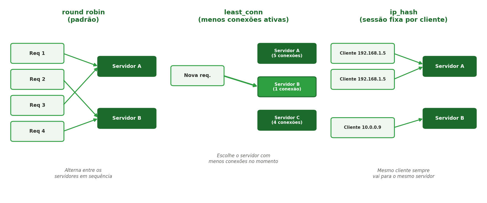

- **round robin** (padrão, sem precisar declarar nada): simples e previsível, mas não leva em conta se um servidor já está mais sobrecarregado que outro.
- **least_conn**: mais justo quando as requisições têm duração muito diferente entre si — evita empilhar tráfego num servidor que já está processando algo pesado.
- **ip_hash**: garante que o mesmo cliente sempre caia no mesmo servidor (chamado de *sticky session*), importante quando a aplicação guarda estado em memória local (ex.: sessão de login) e não teria como recuperar esse estado se a requisição seguinte caísse em outro servidor.

### Health checks e failover

O Nginx também pode marcar um servidor do `upstream` como indisponível automaticamente, e parar de enviar tráfego para ele até que volte a responder:

```nginx
upstream meu_backend {
    server 127.0.0.1:3000 max_fails=3 fail_timeout=30s;
    server 127.0.0.1:3001 max_fails=3 fail_timeout=30s;
    server 127.0.0.1:3002 backup;   # só recebe tráfego se todos os outros falharem
}
```
`max_fails=3 fail_timeout=30s` significa: depois de 3 falhas seguidas, aquele servidor é considerado fora do ar por 30 segundos, período em que o Nginx não tenta mais enviar requisições para ele.

### Cache e compressão

Duas otimizações comuns aplicadas na camada de proxy reverso, antes mesmo de a requisição chegar à aplicação:

```nginx
# Compressão gzip das respostas — reduz o tamanho transferido pela rede
gzip_types text/plain text/css application/json application/javascript;

# Cache de respostas do backend, evitando repetir processamento
proxy_cache_path /var/cache/nginx levels=1:2 keys_zone=meu_cache:10m max_size=100m;

server {
    location / {
        proxy_pass http://meu_backend;
        proxy_cache meu_cache;
        proxy_cache_valid 200 10m;   # respostas com status 200 ficam em cache por 10 minutos
    }
}
```

Se estiver criando o `proxy_cache_path` pela primeira vez, garanta que o diretório de cache existe e tem permissão de escrita:

```bash
sudo mkdir -p /var/cache/nginx
sudo chown -R www-data:www-data /var/cache/nginx
```

E sempre teste antes de recarregar:

```bash
sudo nginx -t
sudo systemctl reload nginx
```

### Logs de acesso e erro

Todo acesso ao Nginx fica registrado por padrão, o que é essencial para investigar problemas e entender o tráfego:

```bash
# Logs de acesso (cada requisição recebida)
sudo tail -f /var/log/nginx/access.log

# Logs de erro (falhas de configuração, proxy indisponível, etc.)
sudo tail -f /var/log/nginx/error.log
```

### Exercícios

1. Suba duas aplicações simples em portas diferentes (3000 e 3001) e configure o Nginx para redirecionar `/app1` para uma e `/app2` para outra.
2. Configure um `upstream` com as duas aplicações do exercício anterior e teste o balanceamento round robin, atualizando a página várias vezes.
3. Configure `max_fails` e `fail_timeout` no `upstream`, derrube uma das aplicações de propósito, e observe pelo `access.log`/`error.log` o Nginx deixando de enviar tráfego para ela.
4. Adicione um cabeçalho de resposta customizado (`add_header`) no Nginx e confirme que ele aparece na resposta usando `curl -I http://localhost`.
5. Explique, em texto, por que normalmente não se expõe a aplicação diretamente à internet, preferindo colocá-la atrás de um proxy reverso.

---

## Semana 8 — TLS/SSL

### Teoria

O **TLS** (Transport Layer Security, sucessor do SSL) garante que a comunicação entre cliente e servidor seja criptografada e autenticada. É o que torna possível o **HTTPS**.

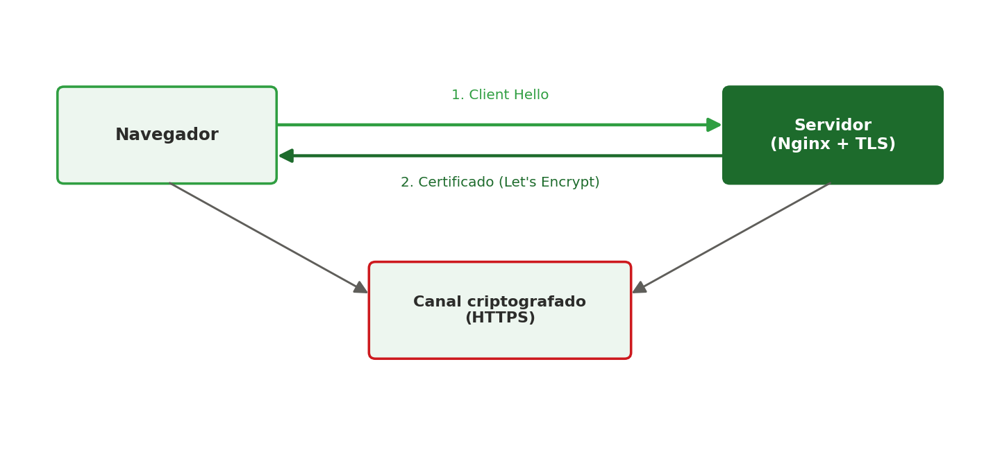

De forma simplificada: o navegador inicia a conexão, o servidor apresenta um **certificado digital** (emitido por uma autoridade certificadora, como o **Let's Encrypt**), e a partir daí toda comunicação passa a ser criptografada.

#### Como funciona o handshake, passo a passo

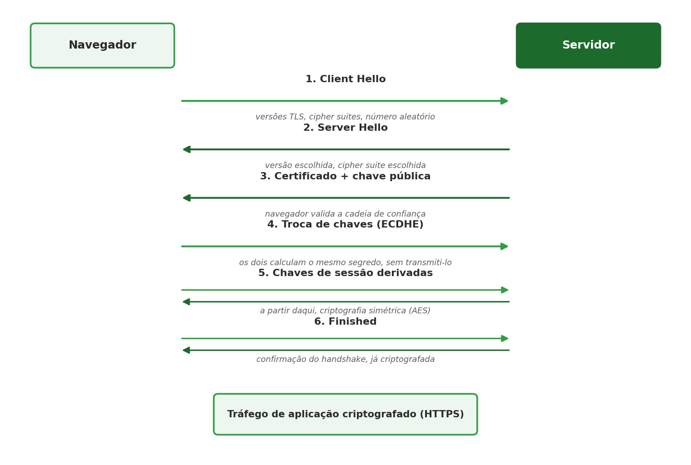

1. **Client Hello** — o navegador envia as versões de TLS e os algoritmos de criptografia (*cipher suites*) que suporta, além de um número aleatório.
2. **Server Hello** — o servidor escolhe a versão e o algoritmo que serão usados, e envia seu próprio número aleatório.
3. **Certificado** — o servidor envia seu certificado digital (com a chave pública). O navegador valida se ele foi emitido por uma autoridade confiável, se não expirou e se o domínio bate com o acessado.
4. **Troca de chaves** — cliente e servidor combinam matematicamente (via *ECDHE*) um segredo compartilhado, sem nunca transmiti-lo pela rede. O servidor assina essa etapa com sua chave privada, provando ser o dono legítimo do certificado.
5. **Chaves de sessão** — a partir desse segredo, os dois calculam, cada um de forma independente, as mesmas chaves de criptografia **simétrica** (bem mais rápida que a assimétrica usada até aqui).
6. **Finished** — uma última mensagem, já criptografada, confirma que o handshake deu certo. Dali em diante, todo o tráfego da aplicação (o `GET /index.html`, por exemplo) vai criptografado.

Em resumo: a criptografia assimétrica (mais lenta) entra só para **combinar uma chave de forma segura** e **autenticar o servidor**; a criptografia simétrica (mais rápida) cuida do restante da conversa. Tudo isso acontece em milissegundos, antes mesmo da página começar a carregar.

### Comandos essenciais

Para ambientes reais expostos à internet, o **Certbot** automatiza a emissão de certificados Let's Encrypt:

```bash
sudo apt install certbot python3-certbot-nginx
sudo certbot --nginx -d seudominio.com
```

> No WSL2, como normalmente não há um domínio público apontando para a máquina, usamos um **certificado autoassinado** apenas para fins didáticos:

```bash
sudo mkdir -p /etc/nginx/ssl
sudo openssl req -x509 -nodes -days 365 \
  -newkey rsa:2048 \
  -keyout /etc/nginx/ssl/selfsigned.key \
  -out /etc/nginx/ssl/selfsigned.crt \
  -subj "/CN=localhost"
```

Configuração do Nginx para HTTPS (`/etc/nginx/sites-available/default`):

```nginx
server {
    listen 443 ssl;
    server_name localhost;

    ssl_certificate     /etc/nginx/ssl/selfsigned.crt;
    ssl_certificate_key /etc/nginx/ssl/selfsigned.key;

    location / {
        proxy_pass http://127.0.0.1:3000;
    }
}
```

```bash
sudo nginx -t
sudo systemctl reload nginx
```

Acesse `https://localhost` (o navegador vai alertar que o certificado não é confiável — normal para um certificado autoassinado).

#### Redirecionamento automático de HTTP para HTTPS

Com os dois ao mesmo tempo no ar (porta 80 e porta 443), é uma boa prática fazer com que quem acessar por HTTP seja **automaticamente redirecionado** para HTTPS, em vez de simplesmente servir o conteúdo sem criptografia nos dois casos.

Edite `/etc/nginx/sites-available/default` e transforme o bloco da porta 80 em um redirecionamento, mantendo o bloco da 443 como já está:

```nginx
server {
    listen 80;
    server_name localhost;

    # Redireciona tudo que chegar por HTTP para a versão HTTPS
    return 301 https://$host$request_uri;
}

server {
    listen 443 ssl;
    server_name localhost;

    ssl_certificate     /etc/nginx/ssl/selfsigned.crt;
    ssl_certificate_key /etc/nginx/ssl/selfsigned.key;

    location / {
        proxy_pass http://127.0.0.1:3000;
    }
}
```

- **`return 301 https://$host$request_uri;`** — responde com um redirecionamento permanente (código 301), mandando o navegador refazer a mesma requisição, só que em HTTPS. `$host` preserva o domínio acessado, e `$request_uri` preserva o caminho e os parâmetros originais da URL.

Aplique e teste:

```bash
sudo nginx -t
sudo systemctl reload nginx

# Confirme o redirecionamento sem seguir automaticamente (-I mostra só os cabeçalhos)
curl -I http://localhost
```

Você deve ver `HTTP/1.1 301 Moved Permanently` na resposta, com um cabeçalho `Location: https://localhost/` apontando para a versão segura.

### Exercícios

1. Gere um certificado autoassinado e configure o Nginx para servir sua aplicação via HTTPS na porta 443.
2. Configure um redirecionamento automático de HTTP (porta 80) para HTTPS (porta 443).
3. Use `openssl x509 -in selfsigned.crt -text -noout` para inspecionar os dados do certificado gerado e identifique a data de validade.
4. Desafio (consolidação da Unidade 1): tendo a aplicação rodando com Nginx, proxy reverso e HTTPS configurados manualmente, documente em um `README.md` todos os passos realizados — esse será a base do seu material de apoio para o seminário avaliativo da semana 9.

---

## Checklist geral (Semanas 2 a 8)

- [ ] Systemd habilitado no WSL2 e serviços customizados criados
- [ ] Acesso SSH configurado (com autenticação por chave) e testado localmente
- [ ] Configuração básica de rede verificada (IP, hostname, DNS, rotas)
- [ ] Teste de conectividade realizado (ping, nc, ss, curl)
- [ ] Permissões, usuários, grupos e `chown` praticados
- [ ] LVM simulado com loop devices e volumes redimensionados
- [ ] Scripts de automação criados e agendados via cron
- [ ] Nginx instalado e servindo uma página própria
- [ ] Proxy reverso configurado apontando para uma aplicação local
- [ ] HTTPS configurado com certificado (autoassinado ou Let's Encrypt)
-e 
---

# Unidade 2 — Docker + CI/CD

## Antes de começar: Docker no WSL2

1. **Instale o Docker Engine diretamente no WSL2** (não é obrigatório usar o Docker Desktop do Windows):
   ```bash
   curl -fsSL https://get.docker.com -o get-docker.sh
   sudo sh get-docker.sh
   ```
2. **Adicione seu usuário ao grupo `docker`**, para não precisar de `sudo` em todo comando:
   ```bash
   sudo usermod -aG docker $USER
   ```
   Feche e abra o terminal do WSL2 de novo para o grupo ser aplicado.
3. **Inicie o serviço do Docker** (já que vocês habilitaram o systemd na Semana 2):
   ```bash
   sudo systemctl enable --now docker
   sudo systemctl status docker
   ```
4. **Confirme a instalação:**
   ```bash
   docker --version
   docker run hello-world
   ```
   Se aparecer uma mensagem de boas-vindas do Docker, está tudo certo.
5. **Rede**: assim como o Nginx da Unidade 1, containers no WSL2 expõem portas para `localhost` automaticamente — ao publicar a porta 3000 de um container, ele já fica acessível em `http://localhost:3000` no navegador do Windows.

---

## Semana 10 — Introdução a containers e Docker

### Teoria

Um **container** empacota uma aplicação junto com tudo que ela precisa para rodar (código, dependências, bibliotecas), de forma isolada, leve e portátil. Diferente de uma máquina virtual, que virtualiza um computador inteiro (incluindo um sistema operacional completo), o container compartilha o kernel do sistema operacional host — o que o torna muito mais leve e rápido de iniciar.

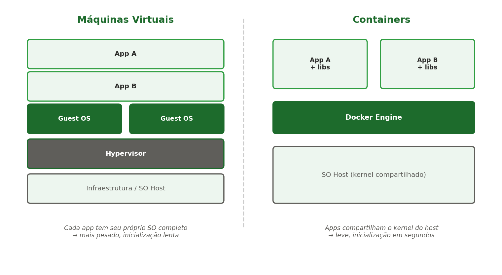

O **Docker** é a ferramenta mais usada para criar, rodar e gerenciar containers. Sua arquitetura básica:

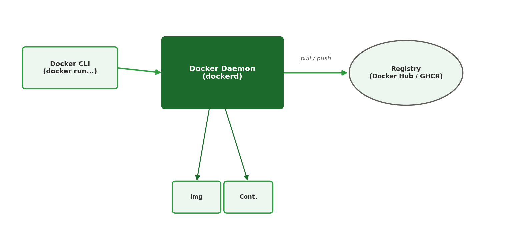

- **Docker CLI** — a ferramenta de linha de comando (`docker ...`) que você usa para dar comandos.
- **Docker Daemon (`dockerd`)** — o processo que realmente gerencia containers, imagens, redes e volumes em segundo plano.
- **Imagem** — um "molde" somente leitura, com tudo que a aplicação precisa (sistema de arquivos, dependências, comando de inicialização).
- **Container** — uma instância em execução de uma imagem.
- **Registry** — um repositório de imagens (ex.: Docker Hub, GitHub Container Registry), de onde imagens são baixadas (`pull`) ou enviadas (`push`).

### Comandos essenciais

```bash
# Baixar uma imagem do Docker Hub
docker pull nginx

# Listar imagens baixadas localmente
docker images

# Rodar um container a partir de uma imagem
docker run nginx

# Rodar em segundo plano (-d) e mapear a porta 8080 do host para a 80 do container
docker run -d -p 8080:80 --name meu-nginx nginx

# Listar containers em execução
docker ps

# Listar todos os containers (inclusive parados)
docker ps -a

# Ver logs de um container
docker logs meu-nginx

# Parar e remover um container
docker stop meu-nginx
docker rm meu-nginx

# Entrar no terminal de um container em execução
docker exec -it meu-nginx bash
```

Acesse `http://localhost:8080` no navegador do Windows — deve aparecer a página padrão do Nginx, agora rodando dentro de um container.

### Criando sua primeira imagem (Dockerfile)

Um `Dockerfile` descreve, passo a passo, como construir uma imagem. Vamos containerizar a mesma aplicação simples usada na Unidade 1:

```dockerfile
FROM python:3.12-slim

WORKDIR /app

COPY . .

EXPOSE 8000

CMD ["python3", "-m", "http.server", "8000"]
```

- **`FROM`** — a imagem-base sobre a qual a sua é construída (aqui, Python já instalado).
- **`WORKDIR`** — define o diretório de trabalho dentro do container.
- **`COPY`** — copia arquivos do seu computador para dentro da imagem.
- **`EXPOSE`** — documenta qual porta a aplicação usa (não publica a porta sozinho — isso é feito no `docker run -p`).
- **`CMD`** — o comando executado quando o container inicia.

Construa e rode:

```bash
# Construir a imagem a partir do Dockerfile na pasta atual
docker build -t minha-app:1.0 .

# Rodar a imagem construída
docker run -d -p 8000:8000 --name minha-app minha-app:1.0

# Testar
curl http://localhost:8000
```

### Exercícios

1. Baixe e rode a imagem oficial do `nginx`, mapeando para a porta 8080, e acesse pelo navegador.
2. Containerize a aplicação Python simples (ou a página estática da Semana 6) usando o `Dockerfile` acima.
3. Use `docker exec -it` para entrar no container rodando e explorar seu sistema de arquivos com `ls`.
4. Desafio: pesquise a diferença entre `docker stop` e `docker kill`, e explique quando usar cada um.

---

## Semana 11 — Docker avançado

### Teoria

Containers são, por natureza, **efêmeros**: ao serem removidos, tudo que foi escrito dentro deles se perde. Para dados que precisam persistir (como os de um banco de dados), o Docker oferece **volumes**:

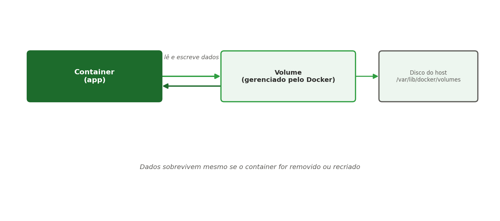

Além disso, containers se comunicam entre si através de **redes Docker**, e imagens mais eficientes são construídas com a técnica de **multi-stage build**, que separa a etapa de compilação da etapa final de execução, reduzindo bastante o tamanho da imagem.

### Comandos essenciais — volumes

```bash
# Criar um volume nomeado
docker volume create dados_app

# Rodar um container usando esse volume
docker run -d -v dados_app:/var/lib/dados --name app-com-volume minha-app:1.0

# Listar volumes
docker volume ls

# Inspecionar onde o volume está no disco do host
docker volume inspect dados_app

# Remover um volume (o container que o usa precisa estar parado/removido)
docker volume rm dados_app
```

### Comandos essenciais — redes

```bash
# Criar uma rede customizada
docker network create minha-rede

# Rodar dois containers na mesma rede — eles conseguem se comunicar pelo nome
docker run -d --network minha-rede --name banco postgres:16
docker run -d --network minha-rede --name app minha-app:1.0

# Listar redes
docker network ls

# Inspecionar uma rede (mostra quais containers estão conectados)
docker network inspect minha-rede
```

> Dentro da rede `minha-rede`, o container `app` pode acessar o banco simplesmente usando o hostname `banco` — o Docker resolve isso internamente, sem precisar saber o IP.

### Multi-stage build

Uma imagem construída direto com as ferramentas de compilação (compiladores, gerenciadores de pacote completos) costuma ficar desnecessariamente grande. O **multi-stage build** usa uma etapa só para compilar, e copia apenas o resultado final para a imagem que efetivamente vai rodar:

```dockerfile
# Etapa 1: build (imagem maior, com ferramentas de compilação)
FROM node:20 AS build
WORKDIR /app
COPY . .
RUN npm install && npm run build

# Etapa 2: imagem final (muito mais enxuta)
FROM nginx:alpine
COPY --from=build /app/dist /usr/share/nginx/html
EXPOSE 80
```

A imagem final não carrega o Node.js nem as dependências de build — só o resultado (os arquivos estáticos), servidos por um Nginx enxuto (`alpine`).

### Boas práticas de Dockerfile

- Prefira imagens-base **`slim`** ou **`alpine`** (bem menores que as imagens completas).
- Use um arquivo **`.dockerignore`** para não copiar arquivos desnecessários (`.git`, `node_modules`, etc.) para dentro da imagem.
- Combine comandos `RUN` relacionados em uma única linha (com `&&`) para reduzir o número de camadas da imagem.
- Copie primeiro os arquivos de dependências (ex.: `package.json`) e só depois o restante do código — isso aproveita o cache do Docker quando só o código muda, sem precisar reinstalar dependências.

### Exercícios

1. Crie um volume e rode um container de banco de dados (ex.: `postgres` ou `mysql`) usando-o, confirmando que os dados persistem após `docker stop`/`docker start`.
2. Crie uma rede customizada e coloque dois containers nela, confirmando que um consegue acessar o outro pelo nome (`docker exec` em um deles e `ping` ou `curl` no outro).
3. Escreva um `.dockerignore` para o projeto da Semana 10.
4. Desafio: reescreva o `Dockerfile` da Semana 10 usando multi-stage build (mesmo que de forma simulada) e compare o tamanho final da imagem com `docker images`.

---

## Semana 12 — Docker Compose

### Teoria

Gerenciar vários containers relacionados (aplicação, banco de dados, proxy reverso) manualmente via `docker run` fica rapidamente inviável — são várias redes, volumes e parâmetros para lembrar. O **Docker Compose** resolve isso descrevendo toda a stack em um único arquivo `docker-compose.yml`:

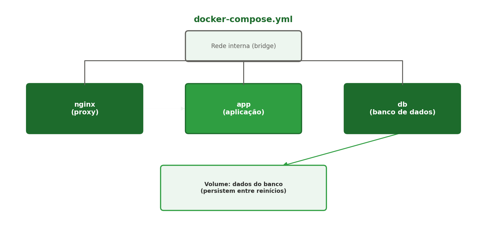

### Comandos e configuração

Exemplo de `docker-compose.yml`, unindo a aplicação, um banco de dados e o Nginx como proxy reverso (reaproveitando o que foi configurado na Unidade 1):

```yaml
version: "3.9"

services:
  app:
    build: .
    expose:
      - "8000"
    networks:
      - rede-interna
    depends_on:
      - db

  db:
    image: postgres:16
    environment:
      POSTGRES_PASSWORD: senha123
      POSTGRES_DB: meubanco
    volumes:
      - dados_db:/var/lib/postgresql/data
    networks:
      - rede-interna

  nginx:
    image: nginx:alpine
    ports:
      - "80:80"
    volumes:
      - ./nginx.conf:/etc/nginx/conf.d/default.conf
    depends_on:
      - app
    networks:
      - rede-interna

networks:
  rede-interna:

volumes:
  dados_db:
```

- **`services`** — cada bloco é um container gerenciado pelo Compose.
- **`build: .`** — constrói a imagem a partir do `Dockerfile` na pasta atual, em vez de usar uma imagem pronta.
- **`depends_on`** — garante a ordem de inicialização (não espera a aplicação "estar pronta", só que o container já tenha subido).
- **`networks`** — todos os serviços na mesma rede interna conseguem se comunicar pelo nome do serviço (`db`, `app`).
- **`volumes`** — `dados_db` persiste os dados do banco entre reinícios.

Comandos principais:

```bash
# Subir toda a stack em segundo plano
docker compose up -d

# Ver o status dos serviços
docker compose ps

# Ver logs de todos os serviços (ou de um específico)
docker compose logs -f
docker compose logs -f app

# Parar e remover os containers (sem apagar os volumes)
docker compose down

# Parar e remover TAMBÉM os volumes (cuidado: apaga os dados)
docker compose down -v

# Reconstruir as imagens após uma mudança no código
docker compose up -d --build
```

### Exercícios

1. Monte um `docker-compose.yml` com a aplicação da Semana 10 e um banco de dados (`postgres` ou `mysql`), na mesma rede interna.
2. Adicione o Nginx como proxy reverso na frente da aplicação, reaproveitando os conceitos da Semana 7.
3. Confirme que os dados do banco persistem após `docker compose down` (sem `-v`) seguido de `docker compose up -d`.
4. Desafio: adicione um quarto serviço (ex.: um `redis` para cache) à stack, e explique, em texto, para que ele poderia servir numa aplicação real.

---

## Semana 13 — Introdução a CI/CD e GitHub Actions

### Teoria

**CI/CD** significa **Integração Contínua** (Continuous Integration) e **Entrega/Implantação Contínua** (Continuous Delivery/Deployment):

- **Integração Contínua**: toda vez que um código é enviado ao repositório, ele é automaticamente construído e testado — detectando problemas cedo, antes de chegarem a produção.
- **Entrega/Implantação Contínua**: o processo de levar essa mudança, já validada, até o ambiente de produção — de forma automatizada, em vez de manual.

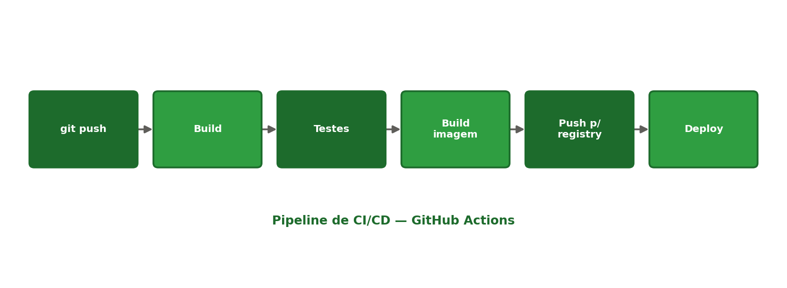

O **GitHub Actions** é a ferramenta de CI/CD integrada ao GitHub. Um workflow é definido em um arquivo YAML dentro de `.github/workflows/`, e é disparado por eventos do repositório (um `push`, um `pull request`, etc.).

### Estrutura de um workflow

```yaml
# .github/workflows/ci.yml
name: CI

on:
  push:
    branches: [main]
  pull_request:
    branches: [main]

jobs:
  build-e-testes:
    runs-on: ubuntu-latest

    steps:
      - name: Baixar o código do repositório
        uses: actions/checkout@v4

      - name: Configurar o Python
        uses: actions/setup-python@v5
        with:
          python-version: "3.12"

      - name: Instalar dependências
        run: pip install -r requirements.txt

      - name: Rodar os testes
        run: pytest
```

- **`on`** — define os eventos que disparam o workflow (aqui, `push` ou `pull request` na branch `main`).
- **`jobs`** — um workflow pode ter um ou mais jobs, cada um rodando em uma máquina virtual própria (`runs-on`).
- **`steps`** — a sequência de passos de um job, executados em ordem.
- **`uses`** — reutiliza uma *action* pronta, feita pela comunidade ou pelo próprio GitHub (ex.: `actions/checkout` baixa o código do repositório para a máquina do workflow).
- **`run`** — executa um comando shell diretamente.

### Comandos e fluxo de trabalho

Não há um "comando" para rodar o GitHub Actions localmente — ele roda automaticamente nos servidores do GitHub sempre que o evento configurado acontece. O fluxo de trabalho típico é:

```bash
# 1. Crie a pasta e o arquivo de workflow no seu projeto
mkdir -p .github/workflows
nano .github/workflows/ci.yml

# 2. Adicione, faça commit e envie para o GitHub
git add .github/workflows/ci.yml
git commit -m "Adiciona pipeline de CI"
git push
```

Depois do `push`, acesse a aba **Actions** do repositório no GitHub para acompanhar a execução do workflow em tempo real.

### Exercícios

1. Crie um repositório no GitHub com o projeto da Semana 10 (ou 12) e adicione um workflow simples que só imprime uma mensagem (`run: echo "Rodando CI"`).
2. Adicione um step que instale as dependências do seu projeto e rode algum tipo de verificação (pode ser um teste simples, ou até um `python3 -m py_compile` validando a sintaxe do código).
3. Faça o workflow falhar de propósito (ex.: um comando inexistente) e observe, na aba Actions do GitHub, como o erro é reportado.
4. Desafio: configure o workflow para rodar também quando um `pull request` for aberto, e explique, em texto, por que isso é uma boa prática em equipes.

---

## Semana 14 — Pipeline completo e lançamento do projeto

### Teoria

Juntando tudo que foi visto até aqui, uma pipeline completa de CI/CD para uma aplicação containerizada costuma seguir estes passos: build da aplicação, testes, build da imagem Docker, push para um registry, e deploy automatizado.

### Comandos e configuração — pipeline completa

```yaml
# .github/workflows/ci-cd.yml
name: CI/CD

on:
  push:
    branches: [main]

jobs:
  build-test-deploy:
    runs-on: ubuntu-latest

    steps:
      - name: Baixar o código
        uses: actions/checkout@v4

      - name: Login no GitHub Container Registry
        uses: docker/login-action@v3
        with:
          registry: ghcr.io
          username: ${{ github.actor }}
          password: ${{ secrets.GITHUB_TOKEN }}

      - name: Build da imagem Docker
        run: docker build -t ghcr.io/${{ github.repository }}:latest .

      - name: Push da imagem para o registry
        run: docker push ghcr.io/${{ github.repository }}:latest

      - name: Deploy (exemplo simplificado)
        run: echo "Aqui entraria o passo de deploy, ex.: via SSH ou docker compose no servidor"
```

- **`secrets.GITHUB_TOKEN`** — um token gerado automaticamente pelo GitHub para cada execução, usado aqui para autenticar no GitHub Container Registry (GHCR) sem precisar expor uma senha.
- **`ghcr.io/${{ github.repository }}`** — monta o caminho da imagem a partir do próprio nome do repositório.
- O passo de **deploy** varia bastante conforme o ambiente real (pode ser um `ssh` para o servidor seguido de `docker compose pull && docker compose up -d`, um `kubectl apply`, ou a chamada a uma API de um provedor de cloud).

### Lançamento do projeto final

A partir desta semana, começa o **projeto final da disciplina**: aplicar, em uma aplicação de verdade (de preferência a mesma evoluída desde a Unidade 1), tudo que foi visto na Unidade 2.

**Entrega esperada:**
- Repositório no GitHub com `Dockerfile` e `docker-compose.yml` funcionais.
- Workflow de GitHub Actions rodando build, testes e push da imagem para um registry (Docker Hub ou GHCR).
- Deploy automatizado (pode ser simplificado/simulado, dependendo do ambiente disponível).
- `README.md` documentando como rodar o projeto.

### Exercícios

1. Defina, em grupo, qual aplicação será usada no projeto final (pode reaproveitar a da Unidade 1).
2. Monte o repositório no GitHub com `Dockerfile` e `docker-compose.yml`.
3. Configure o workflow de build + push da imagem para um registry.
4. Desafio: pesquise uma forma de automatizar o passo de deploy de verdade (ex.: SSH para um servidor próprio, ou um serviço gratuito como Railway/Render), e, se possível, implemente.

---

## Semanas 15 a 17 — Acompanhamento do projeto

> Estas semanas não têm conteúdo novo de teoria — são dedicadas à orientação e ao desenvolvimento do projeto final em grupo, com um checkpoint de entrega a cada semana.

### Semana 15 — Checkpoint 1: Containerização

**O que deve estar pronto:**
- `Dockerfile` da aplicação, funcional (`docker build` sem erros).
- `docker-compose.yml` subindo a aplicação e suas dependências (banco de dados, proxy, etc.).
- Dados persistindo corretamente via volumes.

**Perguntas para se fazer no checkpoint:**
- A imagem está usando boas práticas (imagem-base enxuta, `.dockerignore`, cache de camadas)?
- Os serviços conseguem se comunicar pela rede interna do Compose?

### Semana 16 — Checkpoint 2: Pipeline de CI/CD

**O que deve estar pronto:**
- Workflow de GitHub Actions rodando a cada `push`.
- Build e testes automatizados.
- Build e push da imagem Docker para um registry.

**Perguntas para se fazer no checkpoint:**
- O workflow falha corretamente quando algo está errado (e não silenciosamente)?
- A imagem publicada no registry é a mesma usada no `docker-compose.yml`?

### Semana 17 — Checkpoint 3: Deploy e documentação

**O que deve estar pronto:**
- Passo de deploy configurado no workflow (automatizado ou simulado).
- `README.md` do repositório documentando como rodar o projeto do zero.
- Histórico de commits organizado, refletindo a evolução do trabalho do grupo.

**Perguntas para se fazer no checkpoint:**
- Alguém de fora do grupo conseguiria rodar o projeto só lendo o `README.md`?
- A documentação cobre também como configurar variáveis de ambiente/segredos necessários?

---

## Semana 18 — Apresentação final do projeto

Cada grupo apresenta o projeto desenvolvido ao longo da Unidade 2, demonstrando:

1. A aplicação containerizada rodando (`docker compose up`).
2. O pipeline de CI/CD funcionando — idealmente, uma alteração real sendo enviada ao repositório durante a apresentação, mostrando o workflow disparando automaticamente.
3. O deploy automatizado (ou simulado) resultando na aplicação atualizada.
4. A documentação do projeto.

### Critérios de avaliação

- Containerização correta da aplicação (Dockerfile e Docker Compose funcionais)
- Pipeline de CI/CD funcional (build, testes, push para registry)
- Deploy automatizado funcionando de ponta a ponta
- Qualidade da documentação (README do repositório)
- Histórico de commits/PRs como evidência do processo de desenvolvimento
- Apresentação final: clareza da demonstração e domínio técnico do grupo

---

## Checklist geral (Semanas 10 a 18)

- [ ] Docker instalado e rodando no WSL2 (com systemd)
- [ ] Primeira imagem construída a partir de um Dockerfile próprio
- [ ] Volumes testados, confirmando persistência de dados
- [ ] Rede customizada criada, com containers se comunicando pelo nome
- [ ] Multi-stage build praticado (ou ao menos compreendido)
- [ ] Stack completa (app + banco + proxy) orquestrada via Docker Compose
- [ ] Workflow de GitHub Actions criado e disparando a cada push
- [ ] Pipeline completa: build, testes, push da imagem para um registry
- [ ] Passo de deploy configurado (automatizado ou simulado)
- [ ] Projeto final documentado em um README.md completo
-e 
---

## Material complementar (opcional) — Introdução a Kubernetes

> Conteúdo extra, fora do escopo obrigatório da disciplina. Serve como ponte para quem quiser ir além do Docker Compose (Unidade 2) e se aprofundar em orquestração de containers em escala — bom material também para quem for apresentar o tema no seminário.

### Teoria

O Docker Compose funciona bem para orquestrar containers numa única máquina. O **Kubernetes** entra quando é preciso orquestrar containers em **várias máquinas** (um cluster), com recursos como auto-scaling, auto-healing (reinicia containers que caem sozinhos) e atualização de versões sem downtime.

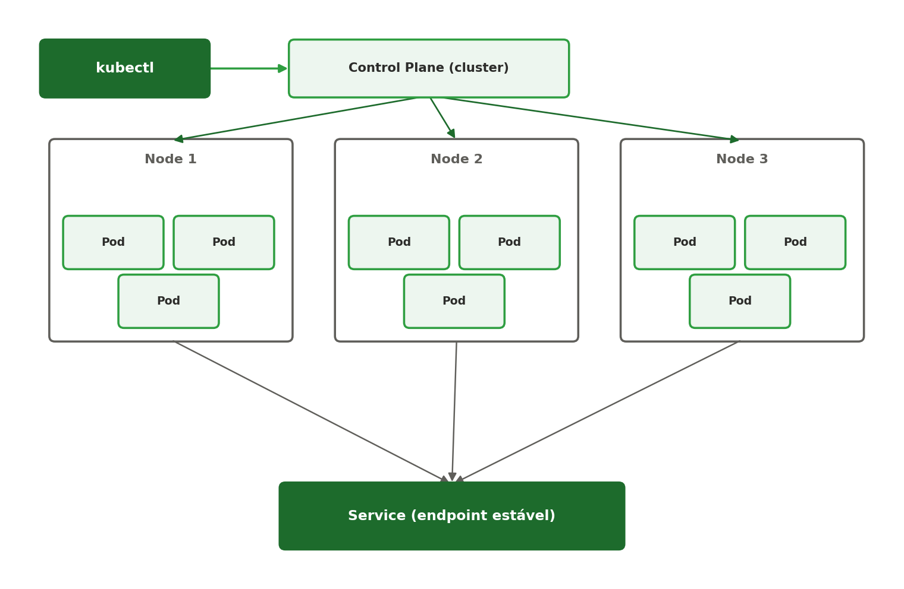

Principais conceitos:

- **Cluster** — o conjunto de máquinas que rodam os containers.
- **Node** — cada máquina do cluster (física ou virtual).
- **Pod** — a menor unidade do Kubernetes: um ou mais containers que rodam juntos, compartilhando rede e armazenamento.
- **Deployment** — declara quantas réplicas de um Pod devem existir, e gerencia atualizações.
- **Service** — expõe um conjunto de Pods como um endereço de rede estável, já que Pods podem morrer e renascer com IPs diferentes.
- **kubectl** — a ferramenta de linha de comando usada para interagir com o cluster.

### Comandos essenciais

Para estudar localmente, sem precisar de um cluster real na nuvem, a opção mais prática no WSL2 (que já tem Docker da Unidade 2) é o **kind** (Kubernetes IN Docker), que roda o cluster inteiro dentro de containers Docker:

```bash
# Instalar o kind
go install sigs.k8s.io/kind@latest

# Criar um cluster local
kind create cluster

# Instalar o kubectl
curl -LO "https://dl.k8s.io/release/$(curl -L -s https://dl.k8s.io/release/stable.txt)/bin/linux/amd64/kubectl"
sudo install kubectl /usr/local/bin/kubectl

# Confirmar que o cluster está no ar
kubectl cluster-info
```

Primeiro exemplo prático — subindo e expondo uma aplicação:

```bash
# Criar um Deployment a partir de uma imagem já existente
kubectl create deployment meu-app --image=nginx

# Expor esse Deployment como um Service
kubectl expose deployment meu-app --port=80 --type=NodePort

# Ver o que está rodando
kubectl get pods
kubectl get deployments
kubectl get services
```

### O jeito declarativo: arquivos YAML

Na prática, em vez de comandos soltos, o estado desejado é descrito em arquivos `.yaml` e aplicado com `kubectl apply`:

```yaml
# deployment.yaml
apiVersion: apps/v1
kind: Deployment
metadata:
  name: meu-app
spec:
  replicas: 3
  selector:
    matchLabels:
      app: meu-app
  template:
    metadata:
      labels:
        app: meu-app
    spec:
      containers:
      - name: meu-app
        image: nginx
        ports:
        - containerPort: 80
```

```bash
kubectl apply -f deployment.yaml
```

Esse é o coração do Kubernetes: você declara **o que quer** (3 réplicas do Nginx rodando), e o cluster se encarrega de manter esse estado — se um Pod cair, outro sobe automaticamente no lugar.

### Exercícios (opcionais)

1. Instale o `kind` e crie um cluster local de um nó.
2. Crie um Deployment do Nginx com `kubectl create deployment` e exponha-o como Service.
3. Escreva o mesmo Deployment em um arquivo `deployment.yaml` e aplique com `kubectl apply -f`.
4. Derrube manualmente um Pod (`kubectl delete pod <nome>`) e observe o Kubernetes recriá-lo automaticamente.
5. Desafio: compare, em texto, o que o `docker-compose.yml` (Semana 12 da Unidade 2) e o `deployment.yaml` do Kubernetes têm em comum e o que é exclusivo de cada um.

---

## Referências

- TITTEL, Ed; SAHA, Sayan; WATT, Steve; ADAM, Michael; BOHAC, Steve. *Container Storage For Dummies*, 2nd Red Hat Special Edition. Hoboken: John Wiley & Sons, 2019. Disponível em: [https://www.redhat.com/rhdc/managed-files/st-container-storage-for-dummies-analyst-material-f31727-202206-en.pdf](https://www.redhat.com/rhdc/managed-files/st-container-storage-for-dummies-analyst-material-f31727-202206-en.pdf).
